# Microsoft Azure Container Service Engine - DC/OS Walkthrough

## Deployment

Here are the steps to deploy a simple DC/OS cluster:

1. [install acs-engine](acsengine.md#downloading-and-building-acs-engine)
2. [generate your ssh key](ssh.md#ssh-key-generation)
3. edit the [DC/OS example](../examples/dcos.json) and fill in the blank strings
4. [generate the template](acsengine.md#generating-a-template)
5. [deploy the output azuredeploy.json and azuredeploy.parameters.json](../README.md#deployment-usage)

## Walkthrough

Once your DC/OS cluster has deployed you will have a resource group containing:

1. a set of 1,3, or 5 masters in a master specific availability set.  Each master's SSH can be accessed via the public dns address at ports 2200..2204

2. a set of public agents in an Virtual Machine Scale Set (VMSS).  The agent VMs can be accessed through a master.  See [agent forwarding](ssh.md#key-management-and-agent-forwarding-with-windows-pageant) for an example of how to do this.

3. a set of private agents in an Virtual Machine Scale Set (VMSS).

The following image shows the architecture of a container service cluster with 3 masters, and 6 agents:

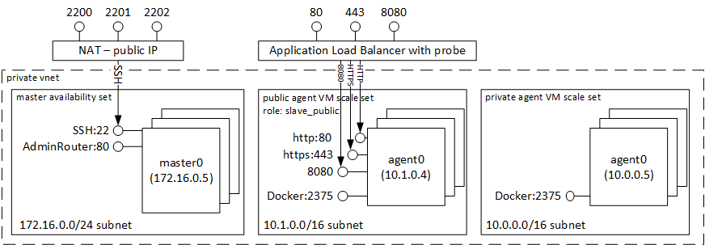

In the image above, you can see the following parts:

1. **Admin Router on port 80** - The admin router enables you to access all DC/OS services.  For example, if you create an SSH tunnel to port 80 you can access the services on the following urls, you can see the DC/OS dashboard by browing to <http://localhost/>
2. **Masters** - Masters run the DC/OS processes that schedule and manage workloads on the agent nodes.
3. **Public Agents** - Public agents, deployed in a VM scale set, are publically accessible through the Azure Load Balancer to ports 80, 443, and 8080.  Jobs can be assigned to public agents using role `slave_public`.
4. **Private Agents** - Private agents, deployed in a VM scale set, are not publically accessible.  Workloads are scheduled to private agents by default.
5. **Docker on port 2375** - The Docker engine runs containerized workloads and each Agent runs the Docker engine.  DC/OS runs Docker workloads, and examples on how to do this are provided in the Marathon walkthrough sections of this readme.

All VMs are in the same VNET where the masters are on private subnet 172.16.0.0/24 and the agents are on the private subnet, 10.0.0.0/8, and fully accessible to each other.

## Create your First Three DC/OS Services: hello-world, Docker app, and Docker web app

This walk through is inspired by the wonderful digital ocean tutorial: https://www.digitalocean.com/community/tutorials/how-to-configure-a-production-ready-mesosphere-cluster-on-ubuntu-14-04.  After completing this walkthrough you will know how to:
 * access DC/OS dashboard for cluster health,
 * deploy a simple hello-world app,
 * deploy a simple docker app,
 * look at logs of your workload,
 * and deploy a simple web app publically available to the world.

 1. After successfully deploying the template write down the two output master and agent FQDNs (Fully Qualified Domain Name).
    1. If using Powershell or CLI, the output parameters are in the OutputsString section named 'agentFQDN' and 'masterFQDN'
    2. If using Portal, to get the output you need to:
        1. navigate to "resource group"
        2. click on the resource group you just created
        3. then click on "Succeeded" under *last deployment*
        4. then click on the "Microsoft.Template"
        5. now you can copy the output FQDNs and sample SSH commands
        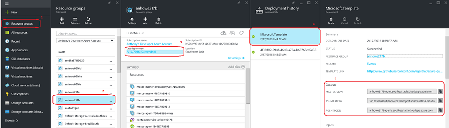

 2. Create an [SSH tunnel to port 80](ssh.md#create-port-80-tunnel-to-the-master) on the master FQDN.

 3. browse to the DC/OS UI <http://localhost/>.  This displays the main DC/OS dashboard:

 4. The front page shows the DC/OS Dashboard:
    1. Scroll down to see your CPU, Memory and Disk Allocation.  This also shows you services, node, and component health.

    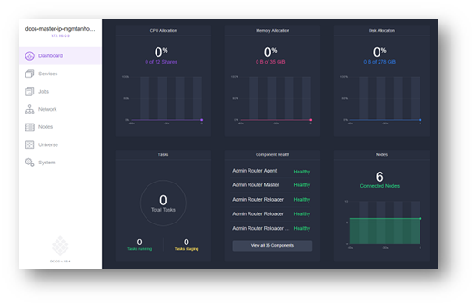

    2. On the left side click "Services"

    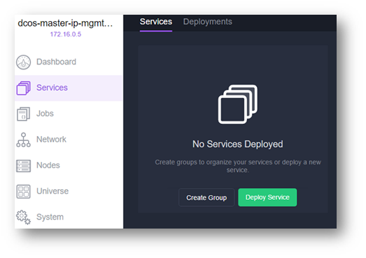

    3. start a long running service
        1. click "Deploy Service"
        2. type "myfirstapp" for the id
        3. type `/bin/bash -c 'for i in {1..5}; do echo MyFirstApp $i; sleep 1; done'` for the command
        4. scroll to bottom and click Deploy

        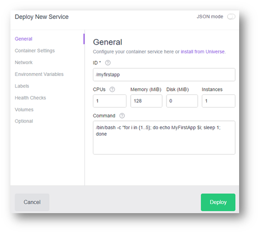

  5. you will notice the new app change state from not running to running

  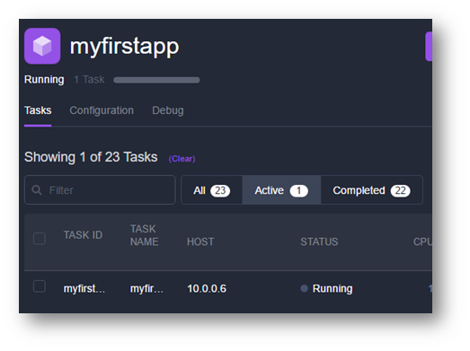

  6. To run a Docker app browse back to Services, and click "Deploy Service" and set id to "/helloworld":

  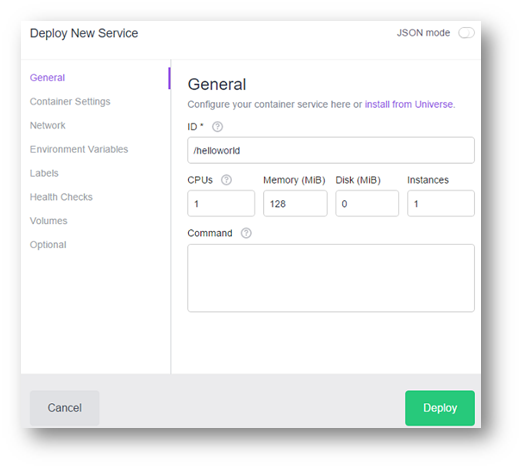

  7. Click "Container Settings", type `hello-world` for image and click "Deploy"

  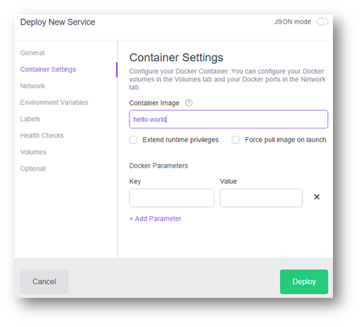

  8. Once deployed, click on the "helloworld" service, and you will see all the finished tasks:

  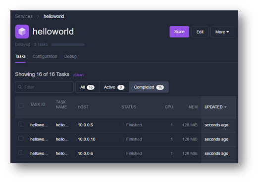

  9. Click on the most recent finished tasks, and click "Logs" and you will see the "Hello from Docker!" message:

  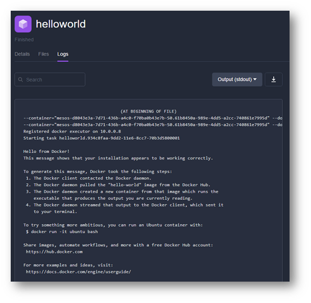

  10. The next step is to deploy a docker web app accessible to the world.  The public agents have a load balancer exposing port 80, 443, and 8080.  On the DC/OS page, browse back to Services, and click "Deploy Service" and set id to "/simpleweb":

  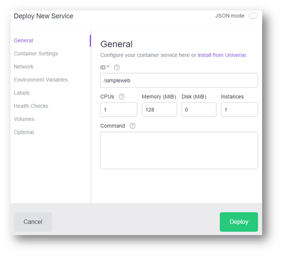

  11. On left, click "Container Settings" and container image "yeasy/simple-web".  This is the image that will be downloaded from DockerHub

  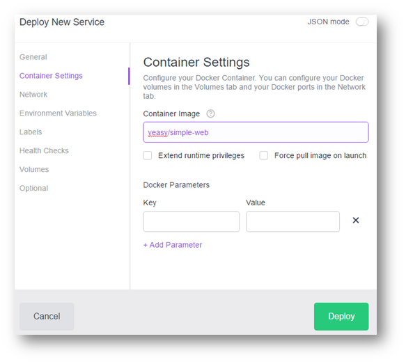

  12. Next on left, click "Network" and type in port 80.  This is how you expose port 80 to the world.

  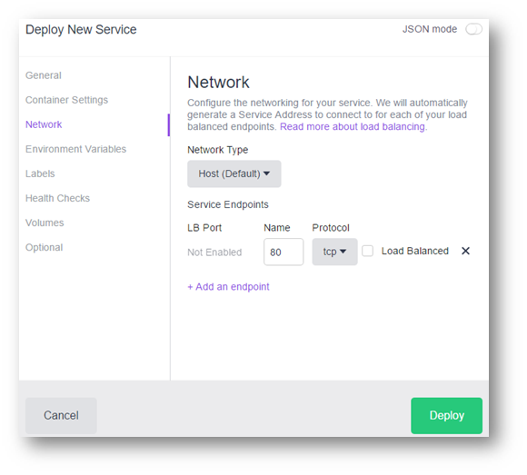

  13. Next on left, click "Optional" and set role type "slave_public".  This ensures the Docker web app is running on the public agent.

  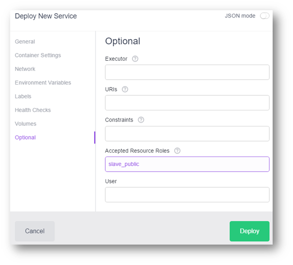

  14. Finally click deploy and watch the web app deploy.  Once it goes to running state, open the FQDN retrieved in step 1 during deployment, and you will see the web app.

  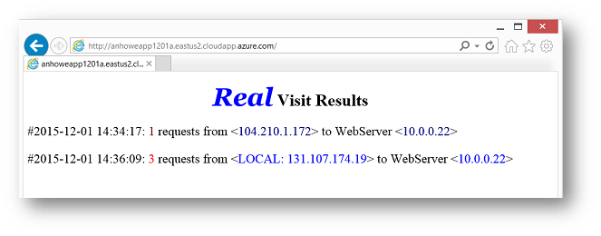

# Learning More

Here are recommended links to learn more about DC/OS:

1. [Azure DC/OS documentation](https://azure.microsoft.com/en-us/documentation/services/container-service/)

## DC/OS Community Documentation

1. [DC/OS Overview](https://dcos.io/docs/1.8/overview/) - provides overview of DC/OS, Architecture, Features, and Concepts.

2. [DC/OS Tutorials](https://docs.mesosphere.com/1.8/usage/tutorials/) - provides various tutorials for DC/OS.
