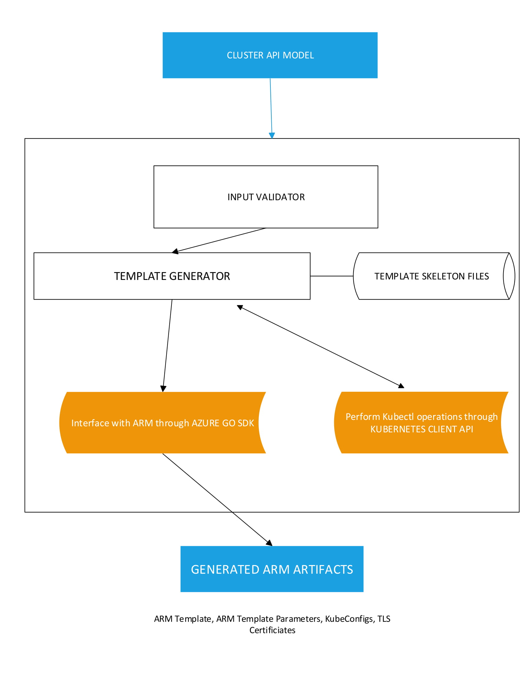

# Acs-engine

The Azure Container Service Engine (acs-engine) is a command line tool that generates ARM (Azure Resource Manager) templates in order for one to deploy container-based clusters (like Kubernetes , DCOS, Openshift, Docker swarm) on the Azure platform.

This design document provides a brief and high-level overview of what acs-engine does internally to achieve deployment of containerized clusters. The scope of this document will be limited to the execution of acs-engine when creating Kubernetes clusters.

## Architecture Diagram



## Components

### Cluster api model

Acs-engine accepts JSONs of cluster api models as inputs. These api models allow the user to specify cluster configuration items such as

- Master and worker nodes configuration
- Kubernetes version
- Authentication params to sign into the Azure platform

### Input Validator

The input validator checks for bad/missing input in the user-provided api models. If there are issues, the execution fails fast and reports the validation errors back to the user.

### Template Generator

Once the input is validated, the template generator is invoked which will convert the apimodel JSON into another JSON which has a format that is well-understood by ARM (Azure Resource Manager). The template generator achieves this through templating where existing skeleton json files are converted into the actual ARM JSONs using the values present in the input api model. These skeleton templates are written in the schema recognized by ARM and they contain placeholders which can be substituted with the values provided in the apimodel JSONs. These templates also nest other template files  inside of it. Given below is an example of a template file with placeholders.

```json
{
  "$schema": "https://schema.management.azure.com/schemas/2015-01-01/deploymentTemplate.json#",
  "contentVersion": "1.0.0.0",
  "parameters": {
    {{range .AgentPoolProfiles}}{{template "agentparams.t" .}},{{end}}
    {{if .HasWindows}}
      "kubeBinariesSASURL": {
        "metadata": {
          "description": "The download url for kubernetes windows binaries."
        },
        "type": "string"
      },
      "windowsPackageSASURLBase": {
        "metadata": {
          "description": "The download url base for windows packages for kubernetes."
        },
        "type": "string"
      },
      "kubeBinariesVersion": {
        "metadata": {
          "description": "Kubernetes windows binaries version"
        },
        "type": "string"
      },
      "windowsTelemetryGUID": {
        "metadata": {
          "description": "The GUID to set in windows agent to collect telemetry data."
        },
        "type": "string"
      },
      {{template "windowsparams.t"}},
    {{end}}
    {{template "masterparams.t" .}},
    {{template "k8s/kubernetesparams.t" .}}
  },
  "variables": {
    {{range $index, $agent := .AgentPoolProfiles}}
        "{{.Name}}Index": {{$index}},
        {{template "k8s/kubernetesagentvars.t" .}}
        {{if IsNSeriesSKU .}}
          {{if IsNVIDIADevicePluginEnabled}}
          "registerWithGpuTaints": "nvidia.com/gpu=true:NoSchedule",
          {{end}}
        {{end}}
        {{if .IsStorageAccount}}
          {{if .HasDisks}}
            "{{.Name}}DataAccountName": "[concat(variables('storageAccountBaseName'), 'data{{$index}}')]",
          {{end}}
          "{{.Name}}AccountName": "[concat(variables('storageAccountBaseName'), 'agnt{{$index}}')]",
        {{end}}
    {{end}}
    {{template "k8s/kubernetesmastervars.t" .}}
  },
  "resources": [
    {{if IsOpenShift}}
      {{template "openshift/infraresources.t" .}}
    {{end}}
    {{ range $index, $element := .AgentPoolProfiles}}
      {{if $index}}, {{end}}
      {{if .IsWindows}}
        {{if .IsVirtualMachineScaleSets}}
          {{template "k8s/kuberneteswinagentresourcesvmss.t" .}}
        {{else}}
          {{template "k8s/kuberneteswinagentresourcesvmas.t" .}}
        {{end}}
      {{else}}
        {{if .IsVirtualMachineScaleSets}}
          {{template "k8s/kubernetesagentresourcesvmss.t" .}}
        {{else}}
          {{template "k8s/kubernetesagentresourcesvmas.t" .}}
        {{end}}
      {{end}}
    {{end}}
    {{if not IsHostedMaster}}
      ,{{template "k8s/kubernetesmasterresources.t" .}}
    {{else}}
      {{if not IsCustomVNET}}
      ,{
        "apiVersion": "[variables('apiVersionDefault')]",
        "dependsOn": [
          "[concat('Microsoft.Network/networkSecurityGroups/', variables('nsgName'))]"
      {{if not IsAzureCNI}}
          ,
          "[concat('Microsoft.Network/routeTables/', variables('routeTableName'))]"
      {{end}}
        ],
        "location": "[variables('location')]",
        "name": "[variables('virtualNetworkName')]",
        "properties": {
          "addressSpace": {
            "addressPrefixes": [
              "[parameters('vnetCidr')]"
            ]
          },
          "subnets": [
            {
              "name": "[variables('subnetName')]",
              "properties": {
                "addressPrefix": "[parameters('masterSubnet')]",
                "networkSecurityGroup": {
                  "id": "[variables('nsgID')]"
                }
      {{if not IsAzureCNI}}
                ,
                "routeTable": {
                  "id": "[variables('routeTableID')]"
                }
      {{end}}
              }
            }
          ]
        },
        "type": "Microsoft.Network/virtualNetworks"
      }
    {{end}}
    {{if not IsAzureCNI}}
    ,{
      "apiVersion": "[variables('apiVersionDefault')]",
      "location": "[variables('location')]",
      "name": "[variables('routeTableName')]",
      "type": "Microsoft.Network/routeTables"
    }
    {{end}}
    ,{
      "apiVersion": "[variables('apiVersionDefault')]",
      "location": "[variables('location')]",
      "name": "[variables('nsgName')]",
      "properties": {
        "securityRules": [
{{if .HasWindows}}
          {
            "name": "allow_rdp",
            "properties": {
              "access": "Allow",
              "description": "Allow RDP traffic to master",
              "destinationAddressPrefix": "*",
              "destinationPortRange": "3389-3389",
              "direction": "Inbound",
              "priority": 102,
              "protocol": "Tcp",
              "sourceAddressPrefix": "*",
              "sourcePortRange": "*"
            }
          },
{{end}}
          {
            "name": "allow_ssh",
            "properties": {
              "access": "Allow",
              "description": "Allow SSH traffic to master",
              "destinationAddressPrefix": "*",
              "destinationPortRange": "22-22",
              "direction": "Inbound",
              "priority": 101,
              "protocol": "Tcp",
              "sourceAddressPrefix": "*",
              "sourcePortRange": "*"
            }
          },
          {
            "name": "allow_kube_tls",
            "properties": {
              "access": "Allow",
              "description": "Allow kube-apiserver (tls) traffic to master",
              "destinationAddressPrefix": "*",
              "destinationPortRange": "443-443",
              "direction": "Inbound",
              "priority": 100,
              "protocol": "Tcp",
              "sourceAddressPrefix": "*",
              "sourcePortRange": "*"
            }
          }
        ]
      },
      "type": "Microsoft.Network/networkSecurityGroups"
    }
    {{end}}
  ],
  "outputs": {
    {{range .AgentPoolProfiles}}{{template "agentoutputs.t" .}}
    {{end}}
    {{if not IsHostedMaster}}
      {{template "masteroutputs.t" .}} ,
    {{end}}
    {{template "iaasoutputs.t" .}}

  }
}
```
The template generator then creates the following artifacts

- ARM Templates (Deploy and Paramater JSONs). These artifacts are used by ARM to effect the actual deployment of the kubernetes clusters.

- KubeConfigs. These are kubernetes config files which can be used by the user or the Kubernetes API clients to perform kubectl operations against the deployed Kubernetes cluster directly.

- TLS certificates. For creating secure connections with the Azure VMs.

### ARM Interface

Acs-engine interfaces with Azure Resource Manager (ARM) through the Azure Go SDK. The Go SDK provides interfaces to perform functions like template deployment, validation.

### Kubernetes Client API

Acs-engine also performs kubernetes cluster management operations (kubectl) through the imported Kubernetes API libraries. The Client API calls are made during the scale and upgrade commands of acs-engine.


Design challenges and proposals
-------------------------------

#### Current Challenges

We find that the current implementation of templating leads to challenges in terms of code readability and maintainability.


- There is no direct and intuitive mapping between the input apimodels and the ARM templates. The placeholder substitutions are performed at very specific areas in the template skeletons. It's hard to draw any generality from it and this makes it difficult to create the template JSONs purely through code as opposed to performing the placeholder substitutions.

- This also limits the capabilities of acs-engine as far as extensibility is concerned. If we were to introduce more changes and customizations, it would potentially entail modifying the template skeleton layouts. This would just add more complexity.

#### Possible Solutions

**Strongly-typed schema for the ARM templates**

As of now, we have no standard/formal representation of the ARM templates. They are declared as loosely typed in the Azure Go SDK.

_**Pros**_

- A formal representation would help us create a more direct mapping between the api model inputs and their corresponding ARM template files.

- This will allow us to accommodate future ARM template customization more effectively, because we can express and maintain the variety of inter-dependent outputs natively, as first class data representations.

- Template validation can be done within the acs-engine layer itself. Currently, template validation can only be performed via the Azure GO SDK and this entails a network call.

_**Cons/Challenges**_

- There are no publicly available specifications for this strongly typed schema. While it is possible for us to implement this, it would take significant time and effort.

- Design-wise, this should be available in an SDK. This would be the best investment of effort as opposed to doing it ourselves as this would benefit multiple customers.

**YAML-based templates**

We could also do away with our current JSON-based template skeletons and use YAML templating instead. 

_**Pros**_

- YAML is more human-readable and allows for annotation through comments. Popular projects like Helm already use this.

- YAML is the defacto standard for representing system definitions and configuration.

- YAML-based templates would require less time/effort when compared to setting up a strongly-typed template schema.


_**Cons/Challenges**_

- While this method is easier to implement, the benefits of extensibility and maintainability are significantly lesser than that provided by a strong schema type.