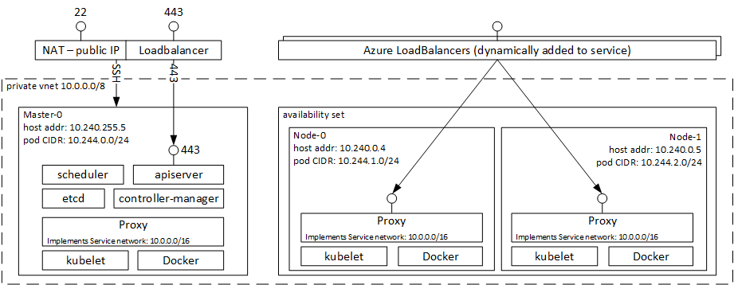
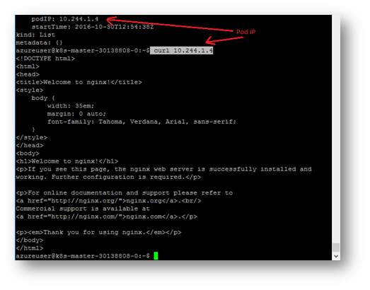
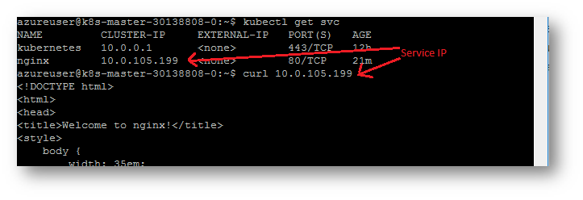
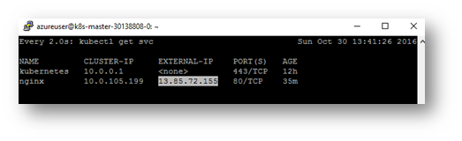
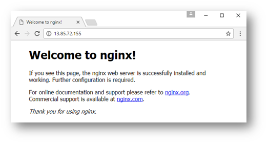
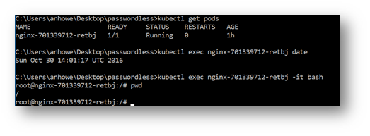
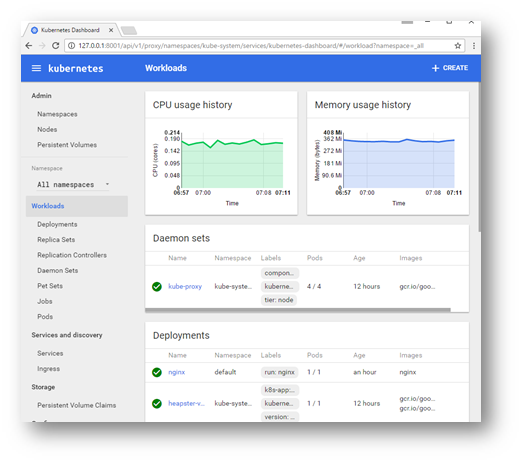

# Microsoft Azure Container Service Engine - Kubernetes Walkthrough

* [Kubernetes Windows Walkthrough](kubernetes.windows.md) - shows how to create a Kubernetes cluster on Windows.
* [Kubernetes with GPU support Walkthrough](kubernetes.gpu.md) - shows how to create a Kubernetes cluster with GPU support.

## Deployment

Here are the steps to deploy a simple Kubernetes cluster:

1. [install acs-engine](acsengine.md#downloading-and-building-acs-engine)
2. [generate your ssh key](ssh.md#ssh-key-generation)
3. [generate your service principal](serviceprincipal.md)
4. edit the [Kubernetes example](../examples/kubernetes.json) and fill in the blank strings
5. [generate the template](acsengine.md#generating-a-template)
6. [deploy the output azuredeploy.json and azuredeploy.parameters.json](../README.md#deployment-usage)
  * To enable the optional network policy enforcement using calico, you have to
    set the parameter during this step according to this [guide](#optional-enable-network-policy-enforcement-using-calico)
7. Temporary workaround when deploying a cluster in a custom VNET with
   Kubernetes 1.6.0:
    1. After a cluster has been created in step 6 get id of the route table resource from Microsoft.Network provider in your resource group. 
       The route table resource id is of the format:
       `/subscriptions/SUBSCRIPTIONID/resourceGroups/RESOURCEGROUPNAME/providers/Microsoft.Network/routeTables/ROUTETABLENAME`
    2. Update properties of all subnets in the newly created VNET that are used by Kubernetes cluster to refer to the route table resource by appending the following to subnet properties:
        ```shell
        "routeTable": {
                "id": "/subscriptions/<SubscriptionId>/resourceGroups/<ResourceGroupName>/providers/Microsoft.Network/routeTables/<RouteTableResourceName>"
              }
        ```

        E.g.:
        ```shell
        "subnets": [
            {
              "name": "subnetname",
              "id": "/subscriptions/<SubscriptionId>/resourceGroups/<ResourceGroupName>/providers/Microsoft.Network/virtualNetworks/<VirtualNetworkName>/subnets/<SubnetName>",
              "properties": {
                "provisioningState": "Succeeded",
                "addressPrefix": "10.240.0.0/16",
                "routeTable": {
                  "id": "/subscriptions/<SubscriptionId>/resourceGroups/<ResourceGroupName>/providers/Microsoft.Network/routeTables/<RouteTableResourceName>"
                }
              ....
              }
              ....
            }
        ]
        ```

## Walkthrough

Once your Kubernetes cluster has been created you will have a resource group containing:

1. 1 master accessible by SSH on port 22 or kubectl on port 443

2. a set of nodes in an availability set.  The nodes can be accessed through a master.  See [agent forwarding](ssh.md#key-management-and-agent-forwarding-with-windows-pageant) for an example of how to do this.

The following image shows the architecture of a container service cluster with 1 master, and 2 agents:



In the image above, you can see the following parts:

1. **Master Components** - The master runs the Kubernetes scheduler, api server, and controller manager.  Port 443 is exposed for remote management with the kubectl cli.
2. **Nodes** - the Kubernetes nodes run in an availability set.  Azure load balancers are dynamically added to the cluster depending on exposed services.
3. **Common Components** - All VMs run a kubelet, Docker, and a Proxy.
4. **Networking** - All VMs are assigned an ip address in the 10.240.0.0/16 network.  Each VM is assigned a /24 subnet for their pod CIDR enabling IP per pod.  The proxy running on each VM implements the service network 10.0.0.0/16.

All VMs are in the same private VNET and are fully accessible to each other.


## Optional: Enable network policy enforcement using Calico

Using the default configuration, Kubernetes allows communication between all
Pods within a cluster. To ensure that Pods can only be accessed by authorized
Pods, a policy enforcement is needed. To enable policy enforcement using Calico
`azuredeploy.parameters.json` needs to be modified like that:

```json
"networkPolicy": {
  "value": "calico"
}
```

This will deploy a Calico node controller to every instance of the cluster
using a Kubernetes DaemonSet. After a successful deployment you should be able
to see these Pods running in your cluster:

```
kubectl get pods --namespace kube-system -l k8s-app=calico-node -o wide
NAME                READY     STATUS    RESTARTS   AGE       IP             NODE
calico-node-034zh   2/2       Running   0          2h        10.240.255.5   k8s-master-30179930-0
calico-node-qmr7n   2/2       Running   0          2h        10.240.0.4     k8s-agentpool1-30179930-1
calico-node-z3p02   2/2       Running   0          2h        10.240.0.5     k8s-agentpool1-30179930-0
```

Per default Calico still allows all communication within the cluster. Using Kubernetes' NetworkPolicy API, you can define stricter policies. Good resources to get information about that are:

* [NetworkPolicy User Guide](https://kubernetes.io/docs/user-guide/networkpolicies/)
* [NetworkPolicy Example Walkthrough](https://kubernetes.io/docs/getting-started-guides/network-policy/walkthrough/)
* [Calico Kubernetes](http://docs.projectcalico.org/v2.0/getting-started/kubernetes/)

## Create your First Kubernetes Service

After completing this walkthrough you will know how to:
 * access Kubernetes cluster via SSH,
 * deploy a simple Docker application and expose to the world,
 * the location of the Kube config file and how to access the Kubernetes cluster remotely,
 * use `kubectl exec` to run commands in a container,
 * and finally access the Kubernetes dashboard.

1. After successfully deploying the template write down the master FQDNs (Fully Qualified Domain Name).
   1. If using Powershell or CLI, the output parameter is in the OutputsString section named 'masterFQDN'
   2. If using Portal, to get the output you need to:
      1. navigate to "resource group"
      2. click on the resource group you just created
      3. then click on "Succeeded" under *last deployment*
      4. then click on the "Microsoft.Template"
      5. now you can copy the output FQDNs and sample SSH commands
      

2. SSH to the master FQDN obtained in step 1.

3. Explore your nodes and running pods:
  1. to see a list of your nodes type `kubectl get nodes`.  If you want full detail of the nodes, add `-o yaml` to become `kubectl get nodes -o yaml`.
  2. to see a list of running pods type `kubectl get pods --all-namespaces`.

4. Start your first Docker image by typing `kubectl run nginx --image nginx`.  This will start the nginx Docker container in a pod on one of the nodes.

5. Type `kubectl get pods -o yaml` to see the full details of the nginx deployment. You can see the host IP and the podIP.  The pod IP is assigned from the pod CIDR on the host.  Run curl to the pod ip to see the nginx output, eg. `curl 10.244.1.4`

  

6. The next step is to expose the nginx deployment as a Kubernetes service on the private service network 10.0.0.0/16:
  1. expose the service with command `kubectl expose deployment nginx --port=80`.
  2. get the service IP `kubectl get service`
  3. run curl to the IP, eg. `curl 10.0.105.199`

  

7. The final step is to expose the service to the world.  This is done by changing the service type from `ClusterIP` to `LoadBalancer`:
  1. edit the service: `kubectl edit svc/nginx`
  2. change `type` from `ClusterIP` to `LoadBalancer` and save it.  This will now cause Kubernetes to create an Azure Load Balancer with a public IP.
  3. the change will take about 2-3 minutes.  To watch the service change from "pending" to an external ip type `watch 'kubectl get svc'`

  

  4. once you see the external IP, you can browse to it in your browser:

    

8. The next step in this walkthrough is to show you how to remotely manage your Kubernetes cluster.  First download Kubectl to your machine and put it in your path:
  * [Windows Kubectl](https://storage.googleapis.com/kubernetes-release/release/v1.6.0/bin/windows/amd64/kubectl.exe)
  * [OSX Kubectl](https://storage.googleapis.com/kubernetes-release/release/v1.6.0/bin/darwin/amd64/kubectl)
  * [Linux](https://storage.googleapis.com/kubernetes-release/release/v1.6.0/bin/linux/amd64/kubectl)

9. The Kubernetes master contains the kube config file for remote access under the home directory ~/.kube/config.  Download this file to your machine, set the KUBECONFIG environment variable, and run kubectl to verify you can connect to cluster:
  * Windows to use pscp from [putty](http://www.chiark.greenend.org.uk/~sgtatham/putty/download.html).  Ensure you have your certificate exposed through [pageant](ssh.md#key-management-and-agent-forwarding-with-windows-pageant):
  ```
  # MASTERFQDN is obtained in step1
  pscp -P 22 azureuser@MASTERFQDN:.kube/config .
  SET KUBECONFIG=%CD%\config
  kubectl get nodes
  ```
  * OS X or Linux:
  ```
  # MASTERFQDN is obtained in step1
  scp azureuser@MASTERFQDN:.kube/config .
  export KUBECONFIG=`pwd`/config
  kubectl get nodes
  ```
10. The next step is to show you how to remotely run commands in a remote Docker container:
  1. Run `kubectl get pods` to show the name of your nginx pod
  2. using your pod name, you can run a remote command on your pod.  eg. `kubectl exec nginx-701339712-retbj date`
  3. try running a remote bash session. eg. `kubectl exec nginx-701339712-retbj -it bash`.  The following screen shot shows these commands:

  

11. The final step of this tutorial is to show you the dashboard:
  1. run `kubectl proxy` to directly connect to the proxy
  2. in your browser browse to the [dashboard](http://127.0.0.1:8001/api/v1/proxy/namespaces/kube-system/services/kubernetes-dashboard/#/workload?namespace=_all)
  3. browse around and explore your pods and services.
  

## Troubleshooting

Scaling your cluster up or down requires different parameters and template than the create. More details here [Scale up](../examples/scale-up/README.md)

If your cluster is not reachable, you can run the following command to check for common failures.

### Misconfigured Service Principal

If your Service Principal is misconfigured, none of the Kubernetes components will come up in a healthy manner.
You can check to see if this the problem:

```shell
ssh -i ~/.ssh/id_rsa USER@MASTERFQDN sudo journalctl -u kubelet | grep --text autorest
```

If you see output that looks like the following, then you have **not** configured the Service Principal correctly.
You may need to check to ensure the credentials were provided accurately, and that the configured Service Principal has
read and **write** permissions to the target Subscription.

`Nov 10 16:35:22 k8s-master-43D6F832-0 docker[3177]: E1110 16:35:22.840688    3201 kubelet_node_status.go:69] Unable to construct api.Node object for kubelet: failed to get external ID from cloud provider: autorest#WithErrorUnlessStatusCode: POST https://login.microsoftonline.com/72f988bf-86f1-41af-91ab-2d7cd011db47/oauth2/token?api-version=1.0 failed with 400 Bad Request: StatusCode=400`

3. [Link](serviceprincipal.md) to documentation on how to create/configure a service principal for an ACS-Engine Kubernetes cluster. 

## Learning More

Here are recommended links to learn more about Kubernetes:

1. [Kubernetes Bootcamp](https://kubernetesbootcamp.github.io/kubernetes-bootcamp/index.html) - shows you how to deploy, scale, update, and debug containerized applications.
2. [Kubernetes Userguide](http://kubernetes.io/docs/user-guide/) - provides information on running programs in an existing Kubernetes cluster.
3. [Kubernetes Examples](https://github.com/kubernetes/kubernetes/tree/master/examples) - provides a number of examples on how to run real applications with Kubernetes.