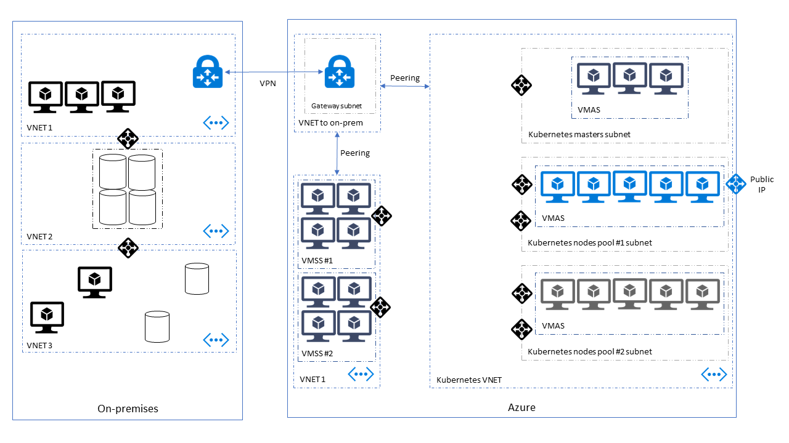

# Running Kubernetes in a hybrid environment

## Introduction

Setting up Kubernetes in a hybrid environment imposes some requirement on the setup, and implies some considerations around how you will configure your cluster, and plan your deployments. In this guide, we will look at a typical hybrid cloud setup to deploy Kubernetes.

Note : We do not cover a Kubernetes cluster _spanning_ a hybrid cloud network, but rather how to run a cluster in the cloud and interact with an existing local network seamlessly.



As illustrated on the figure above, we recommand to deploy the Kubernetes cluster in its own dedicated VNET / subnets and then peer this VNET to the one that allows to access to other resources, both on-premises and in the cloud. This allows you to connect new vnet to your on-premise network by setting up an additional peering. It also separates clusters and environments infrastructure (dev, qa, pre-prod, prod etc...) and facilitate safe Kubernetes version upgrades (see [Cluster upgrades](#cluster-upgrades) section).

## Pre-requisites

This document assumes that you are familiar with:

- Deploying Kubernetes cluster in a [custom VNET using ACS-Engine](../../examples/vnet/README.md)
- Azure [VPN Gateway](https://azure.microsoft.com/en-us/services/vpn-gateway/) and/or [Azure Express Route](https://azure.microsoft.com/en-us/services/expressroute/)
- Azure [Virtual Network Peering](https://docs.microsoft.com/en-us/azure/virtual-network/virtual-network-peering-overview)

## Network and Infrastructure

### Topology

The network topology must be well defined beforehand to enable peering between the different VNET. This means that the subnet IP range must be defined before deploying kubernetes. It cannot be changed afterwards.

### DNS

In a hybrid environment, you usually want to integrate with your on-premises DNS. There is two aspects to this. The first one is to register the VMs forming the cluster, and using your local search domain when resolving other services. The second is getting the services running on Kubernetes to use the external DNS.
To benefit the scaling capabilities of the cluster and to ensure resiliency to machine failure, every node configuration needs to be scripted and part of the initial template that acs-engine will deploy. To register the nodes in your DNS at startup, you need to define [an acs-engine extension](../extensions.md) that will run your [DNS registration script](https://github.com/tesharp/acs-engine/blob/register-dns-extension/extensions/register-dns/v1/register-dns.sh).

In addition, you might want cluster services to address URLs outside the cluster using your on-premise DNS. To achieve this you need to configure KubeDNS to use your existing nameservice as upstream. [This setup is well documented on kubernetes blog](https://kubernetes.io/blog/2017/04/configuring-private-dns-zones-upstream-nameservers-kubernetes)

Note : There is some ongoing work to make this easier. See [acs-engine#2590](https://github.com/Azure/acs-engine/pull/2590)

### Private Cluster

By default, Kubernetes deployment with acs-engine expose the the admin api publicly (and securely). This can be avoided. Using peering with private/on-premise virtual network with ACS-Engine also allows you to create cloud-hosted [private cluster](features.md#private-cluster), with no endpoint exposed over the Internet.

## Kubernetes Network

For your kubernetes cluster to communicate with your on-premise network, you will have to deploy it to the existing vnet setup to communicate through your VPN/ExpressRoute (see Peering). Deploying to an existing VNET is documented under [Custom VNET](../custom-vnet.md).

### Network

Deploying ACS-Engine on Azure, you have 3 options of network policy. Azure CNI, Kubenet, or Calico.

#### Azure CNI

By default, ACS-Engine is using the [**azure cni** network policy](../../examples/networkpolicy/README.md#azure-container-networking-default) plugin. This has some advantages and some consequences that must be considered when defining the network where we deploy the cluster. CNI provides an integration with azure subnet IP addressing so that every pod created by kubernetes is assigned an IP address from the corresponding subnet.
All IP addresses are pre-allocated at provisionning time. By default, [acs-engine will pre-allocate 128 IPs per node](https://github.com/Azure/azure-container-networking/blob/master/docs/acs.md#enabling-azure-vnet-plugins-for-an-acs-kubernetes-cluster) on the subnet.
While this can be configured, new addresses will not be allocated dynamically. That means that you need to anticipate and plan for the maximum number of IP addresses you will need for the maximum scale.

Consequences:

- Plan for *large* address space.
- Subnets where you deploy Kubernetes must be sized according to your scaling plan
- You must account for [Kubernetes control plane](https://kubernetes.io/docs/concepts/overview/components/) services
- Network Security must be applied at the subnet level, using Azure NSG
- You can avoid masquerading on outgoing network calls (packets origin are the pod IP, not the node IP)

#### Kubenet

The built-in kubernetes network plugin is [Kubenet](https://kubernetes.io/docs/concepts/cluster-administration/network-plugins/#kubenet).
Kubenet assigns virtual IPs to the pods running in the cluster that are not part of the physical network infrastructure. The nodes are then configured to forward and masquerade the network calls using iptables rules. This means you can plan for a much smaller address space on your network as only the nodes will get an IP address.

## Kubernetes Services

[Kubernetes Services](https://kubernetes.io/docs/concepts/services-networking/service/) allow to access workloads running inside Kubernetes pods.
Services can be published to be accessible outside of the Kubernetes cluster, either with a public Azure Load Balancer or with a private Azure Load Balancer (no public IP address).

### Public load-balanced service

```yaml
apiVersion: v1
kind: Service
metadata:
  name: sqlservice
  labels:
    app: sqlservice
spec:
  type: LoadBalancer # Exposed over the internet through Azure Load Balancer
  ports:
  - port: 1433
    targetPort: 1433
  selector:
    app: sqlinux
```

### Private load-balanced service

```yaml
apiVersion: v1
kind: Service
metadata:
  name: nginx-internal-load-balancer
  annotations:
    service.beta.kubernetes.io/azure-load-balancer-internal: "true"
spec:
  selector:
    app: nginx
  ports:
    - protocol: TCP
      port: 80
      targetPort: 80
  type: LoadBalancer
```

### External services

When working in a cloud-hybrid environment, it is common to have to deal with external backend services that are running outside the Kubernetes cluster. They can be either running elsewhere in the cloud or on premise. A good practice is to abstract these external endpoints from within the cluster, using a Kubernetes Service.

In these cases you can use services without selector:

```yaml
kind: Service
apiVersion: v1
metadata:
  name: external-random-api
spec:
  ports:
  - protocol: TCP
    port: 80
    targetPort: 8080
```

No endpoint will be created for the above service. You can create one manually:

```yaml
kind: Endpoints
apiVersion: v1
metadata:
  name: external-random-api
subsets:
  - addresses:
      - ip: 11.1.0.4
    ports:
      - port: 8080
```

Or if you defined the upstream nameserver appropriately, you can use an external name in the specification of the service:

```yaml
kind: Service
apiVersion: v1
metadata:
  name: external-service
  namespace: default
spec:
  type: ExternalName
  externalName: external-service.my-company.local
```

Note: when using service without selector, you can't have any Kubernetes readiness/health probe so you have to deal with this point by yourself. For backend services running in Azure, you can use Azure Load Balancers for health probes.

## Cluster upgrades

As you may know, ACS-Engine proposes an [upgrade command](../../examples/k8s-upgrade/README.md). It is really important to understand that this uprade process is *not* fail-safe. Therefore in most cases, and especially with production clusters, a good practice consists of creating another Kubernetes cluster running the targeted version in another VNET and move the workloads into this new cluster. Once everything is tested and works as desired, set up the network redirection to this new environment.

If you plan everything correctly following the documentation above and use Kubernetes Services properly to address both in-cluster and outside services, everything should work fine.

## Conclusion

Setting up Kubernetes to work in an hybrid cloud environment is absolutely possible today and many companies choose this path as a progressive migration to Azure. You can benefit from the flexibility and scalability of Azure, maintain existing systems running on your local network, and get them to talk to eachother *seamlessly*.
This however still requires a non-negligible investment in the infrastructure setup, and maintenance of it.
