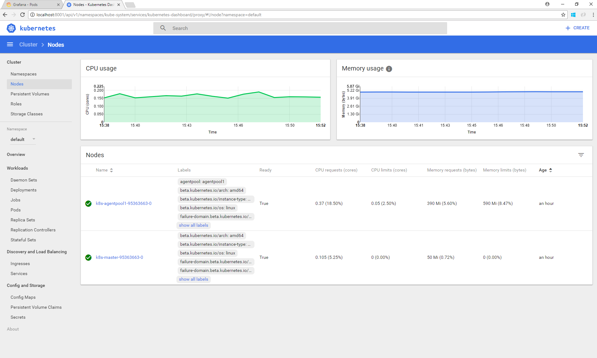
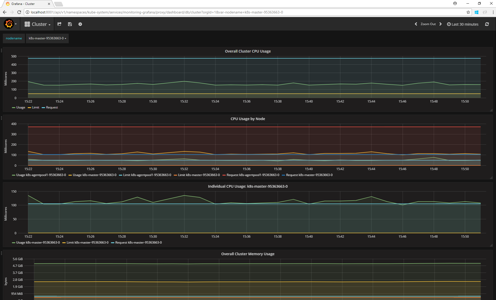
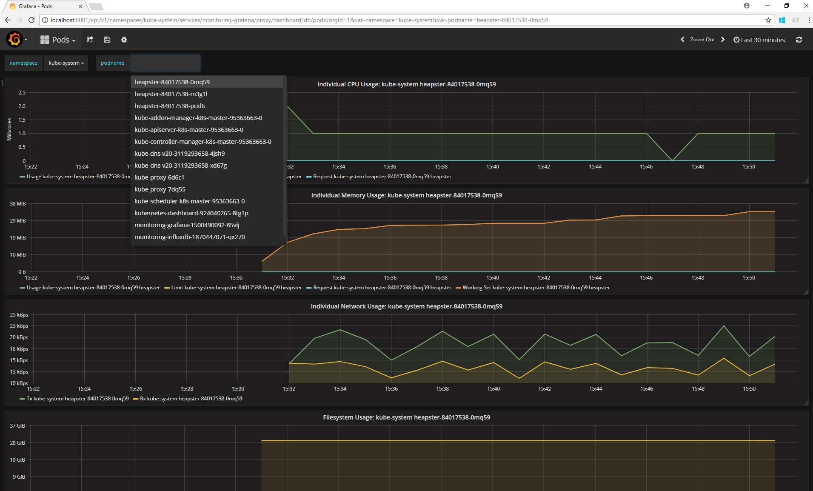

Monitoring Kubernetes Clusters
====

Monitoring your Kubernetes cluster is important to be able to see your cluster's health. By monitoring your cluster, you can see stats such as such as CPU, memory, and disk usage. Monitoring is supported for both Linux as well as Windows nodes in your cluster.

There are five main options to monitor your cluster: 

1. [Kubectl](#kubectl)
2. [Kubernetes dashboard](#kubernetes-dashboard)
3. [Grafana and Influx DB](#grafana-and-influx-db)
4. [Azure Operations Management Suite (OMS)](#oms)
5. [Heapster REST API](#heapster-rest-api)

## Intro to Heapster

Monitoring your cluster in Kubernetes is powered by a component called [Heapster](https://github.com/kubernetes/Heapster/). Heapster is a pod that is responsible for aggregating monitoring data from across all the nodes and pods in your cluster. Heapster is necessary for viewing monitoring data in the Kubernetes dashboard as well as in Grafana. Heapster comes preinstalled on `acs-engine` deployments. To ensure that Heapster is set up in your cluster and is running:
1. Ensure you have set up a [working kubernetes cluster](../kubernetes.md) and are able to use kubectl
2. Run `kubectl get pods --namespace=kube-system`

```shell
$ kubectl get pods --namespace=kube-system
NAME                                            READY     STATUS    RESTARTS   AGE
Heapster-4081560158-cnhn7                       2/2       Running   0          20d
kube-addon-manager-k8s-master-13181513-0        1/1       Running   0          20d
kube-apiserver-k8s-master-13181513-0            1/1       Running   0          20d
kube-controller-manager-k8s-master-13181513-0   1/1       Running   0          20d
kube-dns-v20-3119293658-pnqqs                   3/3       Running   0          20d
kube-dns-v20-3119293658-qbbjw                   3/3       Running   0          20d
kube-proxy-f41qb                                1/1       Running   0          20d
kube-scheduler-k8s-master-13181513-0            1/1       Running   0          20d
kubernetes-dashboard-2957563879-3h8gf           1/1       Running   0          20d
tiller-deploy-1318497129-wb74v                  1/1       Running   0          20d
```
3. Ensure you see Heapster listed and it is in a `Running` state.

## Kubectl

The easiest way to see basic node metrics is by using kubectl. The `kubectl top` command communicates with Heapster to get the latest node metrics and displays them in your terminal.

1. To get node metrics: `kubectl top node`

```shell 
azureuser@k8s-master-95363663-0:~$ kubectl top node
NAME                        CPU(cores)   CPU%      MEMORY(bytes)   MEMORY%
k8s-agentpool1-95363663-0   49m          2%        1298Mi          18%
k8s-master-95363663-0       105m         5%        1317Mi          19%
```

1. To get pod metrics: `kubectl top pod`

```shell
azureuser@k8s-master-95363663-0:~$ kubectl top pod
NAME            CPU(cores)   MEMORY(bytes)
somePod         0m           11Mi
```

## Kubernetes dashboard

The Kubernetes dashboard is an easy way to visualize your cluster metrics. The Kubernetes dashboard displays all the metrics that are collected by the Heapster. The dashboard comes preinstalled on your cluster. To access the dashboard:

1. On Linux, run `kubectl proxy`. This will allow you to access the dashboard at http://localhost:8001/ui
    * If you are using Windows and sshing into the master to use kubectl, you will need to set up remote port forwarding from port 8001 on the master to your host in order to use `kubectl proxy`. To do this, under PUTTY > Connection > SSH > Tunnels, create a new forwarded port (source local port 8001 to destination 127.0.0.1:8001).

Once you have opened the UI, you can explore node stats (CPU, Memory, etc...) under the nodes section on the left menu. You can also see pod level metrics under the pods section, and even drill into a specific container in a given pod.



## Grafana and Influx DB

Another option to see stats is via Grafana and Influx DB. Grafana is a powerful dashboarding tool that can be used to visualize all types of data from various sources. InfluxDB is a database that is used to store time series data. Heapster is responsible for aggregating metrics across your cluster and ingesting them into InfluxDB. Then Grafana uses InfluxDB as it's datasource to visualize metrics. 



To set up Grafana, we will need to deploy Grafana and InfluxDB. We will also need to configure Heapster to use InfluxDB as its storage backend. 

1. `git clone https://github.com/kubernetes/Heapster.git $HOME/heapster`
1. `cd $HOME/heapster`
1. `git checkout release-1.4`
1. `git cherry-pick c674a16f74782b326f02345486b5f9520891f395` (This works around the [open issue](https://github.com/kubernetes/Heapster/issues/1783) with Grafana deployments currently)
1. `kubectl create -f deploy/kube-config/influxdb/influxdb.yaml`
1. `kubectl create -f deploy/kube-config/influxdb/grafana.yaml`
1. `kubectl get pods --namespace=kube-system` Ensure that Heapster, Grafana and InfluxDB are in the `Running` state
1. `kubectl edit deployment/heapster --namespace=kube-system`
1. We need to configure Heapster to use InfluxDB as the the data store. To do that under the spec > containers > command property change the command field from:
   ``` yaml
   command:
   - /heapster
   - --source=kubernetes.summary_api:""
   ```
   to this:
   ```yaml
   command:
   - /heapster
   - --source=kubernetes.summary_api:""
   - --source=kubernetes.summary_api:""
   - --sink=influxdb:http://monitoring-influxdb.kube-system.svc:8086
   ```
1. Save and exit from your editor to change the deployment. Now, Heapster will restart the pods and be configured to use InfluxDB. To ensure everything is ok, check the Heapster logs:
1. `getHeapster() { kubectl get pods -o go-template --template '{{range .items}}{{.metadata.name}}{{"\n"}}{{end}}' --namespace=kube-system | grep -i heapster; }`
1. `kubectl logs $(getHeapster) --namespace=kube-system -c heapster` Look at the logs of heapster to ensure it started up correctly.
You should see something like this if everything is ok:
```shell
azureuser@k8s-master-95363663-0:~/Heapster$ kubectl logs $(getHeapster) --namespace=kube-system -c heapster
I0830 22:30:57.671954       1 Heapster.go:72] /heapster --source=kubernetes:https://kubernetes.default --sink=influxdb:http://monitoring-influxdb.kube-system.svc:8086
I0830 22:30:57.671989       1 Heapster.go:73] Heapster version v1.3.0
I0830 22:30:57.672149       1 configs.go:61] Using Kubernetes client with master "https://kubernetes.default" and version v1
I0830 22:30:57.672166       1 configs.go:62] Using kubelet port 10255
I0830 22:30:57.747473       1 influxdb.go:252] created influxdb sink with options: host:monitoring-influxdb.kube-system.svc:8086 user:root db:k8s
I0830 22:30:57.747548       1 Heapster.go:196] Starting with InfluxDB Sink
I0830 22:30:57.747573       1 Heapster.go:196] Starting with Metric Sink
I0830 22:30:57.759987       1 Heapster.go:106] Starting heapster on port 8082
I0830 22:31:05.106039       1 influxdb.go:215] Created database "k8s" on influxDB server at "monitoring-influxdb.kube-system.svc:8086"
```

If everything looks ok and Grafana and Influx DB were able to start up, you can now access them! To do that:
1. Run `kubectl proxy`.
    * If you are using Windows and sshing into the master to use kubectl, you will need to set up remote port forwarding from port 8001 on the master to your host in order to use `kubectl proxy`. To do this, under Putty > Connection > SSH > Tunnels, create a new forwarded port (source local port 8001 to destination 127.0.0.1:8001).

1. To see cluster stats: http://localhost:8001/api/v1/namespaces/kube-system/services/monitoring-grafana/proxy/dashboard/db/cluster
1. To see pod stats: http://localhost:8001/api/v1/namespaces/kube-system/services/monitoring-grafana/proxy/dashboard/db/pods



## OMS

OMS is a hosted monitoring solution by Microsoft. It can be used to aggregate node metrics, logs, and other information. OMS container support can be configured to monitor a kubernetes cluster. For more information checkout the tutorial at Azure Docs [here.](https://github.com/MicrosoftDocs/azure-docs/blob/master/articles/container-service/kubernetes/container-service-tutorial-kubernetes-monitor.md)

## Heapster REST API

Heapster exposes a REST API that can be used to programmatically obtain cluster metrics. The full documentation for the REST API is [here.](https://github.com/kubernetes/heapster/blob/master/docs/model.md) The REST API can be useful if you need to obtain metrics in your custom application or integrate metrics in an existing system.

Here are a few examples on how to use the REST API.

1. Run `kubectl proxy`
1. `curl http://localhost:8001/api/v1/namespaces/kube-system/services/heapster/proxy/api/v1/model/nodes`

    ```
    [
    "k8s-agentpool1-95363663-0",
    "k8s-master-95363663-0"
    ]
    ```

1. `curl http://localhost:8001/api/v1/namespaces/kube-system/services/heapster/proxy/api/v1/model/nodes/k8s-master-95363663-0/metrics`

    ```
    [
    "cpu/usage",
    "network/rx_errors",
    "memory/major_page_faults",
    "memory/page_faults_rate",
    "cpu/node_allocatable",
    ...
    ]
    ```

1. `curl http://localhost:8001/api/v1/namespaces/kube-system/services/heapster/proxy/api/v1/model/nodes/k8s-master-95363663-0/metrics/cpu/usage`

    ```
    {
        metrics: [
            {
                timestamp: "2017-08-31T00:08:00Z",
                value: 1040133457832
            },
            {
                timestamp: "2017-08-31T00:09:00Z",
                value: 1046556719483
            },
            {
                timestamp: "2017-08-31T00:10:00Z",
                value: 1052835238099
            }
        ],
            latestTimestamp: "2017-08-31T00:10:00Z"
    }
    ```

For more details take a look at the [Heapster model documentation.](https://github.com/kubernetes/heapster/blob/master/docs/model.md)
