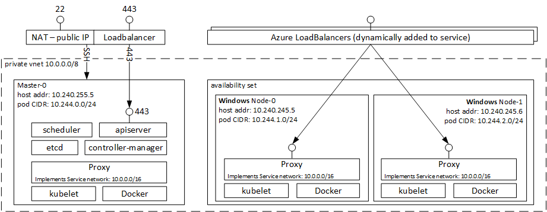

# Microsoft Azure Container Service Engine - Kubernetes Windows Walkthrough

## Supported Windows versions
Prior to acs-engine v0.9.2, Kubernetes Windows cluster uses Windows Server 2016. There are a few restrictions in Windows Networking for Kubernetes as documented in https://blogs.technet.microsoft.com/networking/2017/04/04/windows-networking-for-kubernetes/. Besides, Windows POD deployment performanace is limited due to the bottleneck of container image size and configuration at container start time. 

With the release of new Windows Server version 1709 (a.k.a, RS3), acs-engine v0.9.2 and beyond has leveraged the new Windows version to deploy Kubernetes Windows cluster with signifcant improvement in Windows container and networking performance, as well as new features in storage. Specifically,
1. Windows is now on par with Linux in terms of networking. New features including hostport have been implemented in kube-proxy and Windows platform and CNI to enhance networking performance. Please refer to http://blog.kubernetes.io/2017/09/windows-networking-at-parity-with-linux.html for details.
2. Azure Files and Disks are now supported to mount on Kubernetes Windows cluster with the new SMB feature in Windows.
3. Multiple containers in POD are now supported on Kubernetes Windows cluster.

Note, with the rollout of new Windows version in acs-engine, the workload deployed on Windows cluster requires compatible container image, as documented here: https://docs.microsoft.com/en-us/virtualization/windowscontainers/deploy-containers/version-compatibility

## Deployment

Here are the steps to deploy a simple Kubernetes cluster with Windows:

1. [install acs-engine](../acsengine.md#downloading-and-building-acs-engine)
2. [generate your ssh key](../ssh.md#ssh-key-generation)
3. [generate your service principal](../serviceprincipal.md)
4. edit the [Kubernetes windows example](../../examples/windows/kubernetes.json) and fill in the blank strings
5. [generate the template](../acsengine.md#generating-a-template)
6. [deploy the output azuredeploy.json and azuredeploy.parameters.json](../acsengine.md#deployment-usage)
7. Temporary workaround when deploying a cluster in a custom VNET with Kubernetes 1.6.0:
    1. After a cluster has been created in step 6 get id of the route table resource from Microsoft.Network provider in your resource group. 
       The route table resource id is of the format:
       `/subscriptions/SUBSCRIPTIONID/resourceGroups/RESOURCEGROUPNAME/providers/Microsoft.Network/routeTables/ROUTETABLENAME`
    2. Update properties of all subnets in the newly created VNET that are used by Kubernetes cluster to refer to the route table resource by appending the following to subnet properties:
        ```shell
        "routeTable": {
                "id": "/subscriptions/<SubscriptionId>/resourceGroups/<ResourceGroupName>/providers/Microsoft.Network/routeTables/<RouteTableResourceName>"
              }
        ```

        E.g.:
        ```shell
        "subnets": [
            {
              "name": "subnetname",
              "id": "/subscriptions/<SubscriptionId>/resourceGroups/<ResourceGroupName>/providers/Microsoft.Network/virtualNetworks/<VirtualNetworkName>/subnets/<SubnetName>",
              "properties": {
                "provisioningState": "Succeeded",
                "addressPrefix": "10.240.0.0/16",
                "routeTable": {
                  "id": "/subscriptions/<SubscriptionId>/resourceGroups/<ResourceGroupName>/providers/Microsoft.Network/routeTables/<RouteTableResourceName>"
                }
              ....
              }
              ....
            }
        ]
        ```

## Walkthrough

Once your Kubernetes cluster has been created you will have a resource group containing:

1. 1 master accessible by SSH on port 22 or kubectl on port 443

2. a set of windows and linux nodes.  The windows nodes can be accessed through an RDP SSH tunnel via the master node.  To do this, follow these [instructions](../ssh.md#ssh-to-the-machine), replacing port 80 with 3389.  Since your windows machine is already using port 3389, it is recommended to use 3390 to Windows Node 0, 10.240.0.4, 3391 to Windows Node 1, 10.240.0.5, and so on as shown in the following image:


The following image shows the architecture of a container service cluster with 1 master, and 2 agents:



In the image above, you can see the following parts:

1. **Master Components** - The master runs the Kubernetes scheduler, api server, and controller manager.  Port 443 is exposed for remote management with the kubectl cli.
2. **Linux Nodes** - the Kubernetes nodes run in an availability set.  Azure load balancers are dynamically added to the cluster depending on exposed services.
3. **Windows Nodes** - the Kubernetes windows nodes run in an availability set.
3. **Common Components** - All VMs run a kubelet, Docker, and a Proxy.
4. **Networking** - All VMs are assigned an ip address in the 10.240.0.0/16 network.  Each VM is assigned a /24 subnet for their pod CIDR enabling IP per pod.  The proxy running on each VM implements the service network 10.0.0.0/16.

All VMs are in the same private VNET and are fully accessible to each other.

## Create your First Kubernetes Service

After completing this walkthrough you will know how to:
 * access Kubernetes cluster via SSH,
 * deploy a simple Windows Docker application and expose to the world,
 * and deploy a hybrid Windows / Linux Docker application.
 
1. After successfully deploying the template write down the master FQDN (Fully Qualified Domain Name).
   1. If using Powershell or CLI, the output parameter is in the OutputsString section named 'masterFQDN'
   2. If using Portal, to get the output you need to:
     1. navigate to "resource group"
     2. click on the resource group you just created
     3. then click on "Succeeded" under *last deployment*
     4. then click on the "Microsoft.Template"
     5. now you can copy the output FQDNs and sample SSH commands

   

2. SSH to the master FQDN obtained in step 1.

3. Explore your nodes and running pods:
  1. to see a list of your nodes type `kubectl get nodes`.  If you want full detail of the nodes, add `-o yaml` to become `kubectl get nodes -o yaml`.
  2. to see a list of running pods type `kubectl get pods --all-namespaces`.  By default DNS, heapster, and the dashboard pods will be assigned to the Linux nodes.

4. Start your first Docker image by editing a file named `simpleweb.yaml` filling in the contents below, and then apply by typing `kubectl apply -f simpleweb.yaml`.  This will start a windows simple web application and expose to the world.

  ```yaml
  apiVersion: v1
  kind: Service
  metadata:
    name: win-webserver
    labels:
      app: win-webserver
  spec:
    ports:
      # the port that this service should serve on
    - port: 80
      targetPort: 80
    selector:
      app: win-webserver
    type: LoadBalancer
  ---
  apiVersion: extensions/v1beta1
  kind: Deployment
  metadata:
    labels:
      app: win-webserver
    name: win-webserver
  spec:
    replicas: 1
    template:
      metadata:
        labels:
          app: win-webserver
        name: win-webserver
      spec:
        containers:
        - name: windowswebserver
          image: microsoft/windowsservercore:1709
          command:
          - powershell.exe
          - -command
          - "<#code used from https://gist.github.com/wagnerandrade/5424431#> ; $$listener = New-Object System.Net.HttpListener ; $$listener.Prefixes.Add('http://*:80/') ; $$listener.Start() ; $$callerCounts = @{} ; Write-Host('Listening at http://*:80/') ; while ($$listener.IsListening) { ;$$context = $$listener.GetContext() ;$$requestUrl = $$context.Request.Url ;$$clientIP = $$context.Request.RemoteEndPoint.Address ;$$response = $$context.Response ;Write-Host '' ;Write-Host('> {0}' -f $$requestUrl) ;  ;$$count = 1 ;$$k=$$callerCounts.Get_Item($$clientIP) ;if ($$k -ne $$null) { $$count += $$k } ;$$callerCounts.Set_Item($$clientIP, $$count) ;$$header='<html><body><H1>Windows Container Web Server</H1>' ;$$callerCountsString='' ;$$callerCounts.Keys | % { $$callerCountsString+='<p>IP {0} callerCount {1} ' -f $$_,$$callerCounts.Item($$_) } ;$$footer='</body></html>' ;$$content='{0}{1}{2}' -f $$header,$$callerCountsString,$$footer ;Write-Output $$content ;$$buffer = [System.Text.Encoding]::UTF8.GetBytes($$content) ;$$response.ContentLength64 = $$buffer.Length ;$$response.OutputStream.Write($$buffer, 0, $$buffer.Length) ;$$response.Close() ;$$responseStatus = $$response.StatusCode ;Write-Host('< {0}' -f $$responseStatus)  } ; "
        nodeSelector:
          beta.kubernetes.io/os: windows
  ```

5. Type `watch kubectl get pods` to watch the deployment of the service that takes about 30 seconds.  Once running, type `kubectl get svc` and curl the 10.x address to see the output, eg. `curl 10.244.1.4`

6. Type `watch kubectl get svc` to watch the addition of the external IP address that will take about 2-5 minutes.  Once there, you can take the external IP and view in your web browser.

## Example using Azure Files and Azure Disks
### Create Azure File workload
This example is modified after https://github.com/andyzhangx/Demo/tree/master/windows/azurefile/rs3

#### 1. Create an azure file storage class
```kubectl apply -f https://raw.githubusercontent.com/JiangtianLi/Examples/master/windows/azurefile/storageclass-azurefile.yaml```

#### make sure storageclass is created successfully
```
kubectl get storageclass/azurefile -o wide
```

#### 2. Create a pvc for azure file
```kubectl apply -f https://raw.githubusercontent.com/JiangtianLi/Examples/master/windows/azurefile/pvc-azurefile.yaml```

#### make sure pvc is created successfully
```
kubectl get pvc/pvc-azurefile -o wide
```

#### 3. Create a pod with azure file pvc
```kubectl apply -f https://raw.githubusercontent.com/JiangtianLi/Examples/master/windows/azurefile/iis-azurefile.yaml```

#### watch the status of pod until its `STATUS` is `Running`
```
watch kubectl get po/iis-azurefile -o wide
```

#### 4. Enter the pod container to validate
```
kubectl exec -it iis-azurefile -- cmd
```

```
C:\>dir c:\mnt\azure
 Volume in drive C has no label.
 Volume Serial Number is F878-8D74

 Directory of c:\mnt\azure

11/16/2017  09:45 PM    <DIR>          .
11/16/2017  09:45 PM    <DIR>          ..
               0 File(s)              0 bytes
               2 Dir(s)   5,368,709,120 bytes free

```

### Create Azure Disk workload
This example is modified after https://github.com/andyzhangx/Demo/tree/master/windows/azuredisk/rs3

#### 1. Create an azure disk storage class

##### option#1: k8s agent pool is based on blob disk VM
```kubectl apply -f https://raw.githubusercontent.com/JiangtianLi/Examples/master/windows/azuredisk/storageclass-azuredisk.yaml```

##### option#2: k8s agent pool is based on managed disk VM
```kubectl apply -f https://raw.githubusercontent.com/JiangtianLi/Examples/master/windows/azuredisk/storageclass-azuredisk-managed.yaml```

#### make sure storageclass is created successfully
```
kubectl get storageclass/azuredisk -o wide
```

#### 2. Create a pvc for azure disk
```kubectl apply -f https://raw.githubusercontent.com/JiangtianLi/Examples/master/windows/azuredisk/pvc-azuredisk.yaml```

#### make sure pvc is created successfully
```
kubectl get pvc/pvc-azuredisk -o wide
```

#### 3. Create a pod with azure disk pvc
```kubectl apply -f https://raw.githubusercontent.com/JiangtianLi/Examples/master/windows/azuredisk/iis-azuredisk.yaml```

#### watch the status of pod until its `STATUS` is `Running`
```
watch kubectl get po/iis-azuredisk -o wide
```

#### 4. Enter the pod container to validate
```
kubectl exec -it iis-azuredisk -- cmd
```


## Example using multiple containers in a POD
```yaml
apiVersion: extensions/v1beta1
kind: Deployment
metadata:
  labels:
    app: two-containers
  name: two-containers
spec:
  replicas: 1
  template:
    metadata:
      labels:
        app: two-containers
      name: two-containers
    spec:
      volumes:
      - name: shared-data
        emptyDir: {}

      containers:

        - name: iis-container
          image: microsoft/iis:windowsservercore-1709
          volumeMounts:
          - name: shared-data
            mountPath: /wwwcache
          command: 
          - powershell.exe
          - -command 
          - "while ($true) { Start-Sleep -Seconds 10; Copy-Item -Path C:\\wwwcache\\iisstart.htm -Destination C:\\inetpub\\wwwroot\\iisstart.htm; }"            

        - name: servercore-container
          image: microsoft/windowsservercore:1709
          volumeMounts:
          - name: shared-data
            mountPath: /poddata
          command: 
          - powershell.exe
          - -command 
          - "$i=0; while ($true) { Start-Sleep -Seconds 10; $msg = 'Hello from the servercore container, count is {0}' -f $i; Set-Content -Path C:\\poddata\\iisstart.htm -Value $msg; $i++; }"

      nodeSelector:
        beta.kubernetes.io/os: windows
```

## Real-world Workload
TODO

## Troubleshooting

If your cluster is not reachable, you can run the following command to check for common failures.

### Misconfigured Service Principal

If your Service Principal is misconfigured, none of the Kubernetes components will come up in a healthy manner.
You can check to see if this the problem:

```shell
ssh -i ~/.ssh/id_rsa USER@MASTERFQDN sudo journalctl -u kubelet | grep --text autorest
```

If you see output that looks like the following, then you have **not** configured the Service Principal correctly.
You may need to check to ensure the credentials were provided accurately, and that the configured Service Principal has
read and **write** permissions to the target Subscription.

`Nov 10 16:35:22 k8s-master-43D6F832-0 docker[3177]: E1110 16:35:22.840688    3201 kubelet_node_status.go:69] Unable to construct api.Node object for kubelet: failed to get external ID from cloud provider: autorest#WithErrorUnlessStatusCode: POST https://login.microsoftonline.com/72f988bf-86f1-41af-91ab-2d7cd011db47/oauth2/token?api-version=1.0 failed with 400 Bad Request: StatusCode=400`

## Learning More

Here are recommended links to learn more about Kubernetes:

1. [Kubernetes Bootcamp](https://kubernetesbootcamp.github.io/kubernetes-bootcamp/index.html) - shows you how to deploy, scale, update, and debug containerized applications.
2. [Kubernetes Userguide](http://kubernetes.io/docs/user-guide/) - provides information on running programs in an existing Kubernetes cluster.
3. [Kubernetes Examples](https://github.com/kubernetes/kubernetes/tree/master/examples) - provides a number of examples on how to run real applications with Kubernetes.
