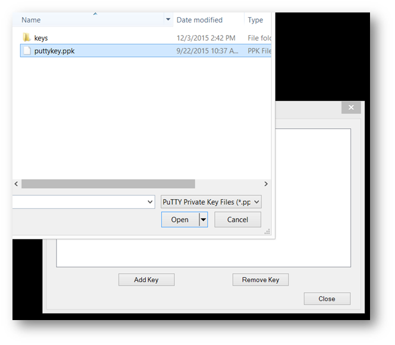
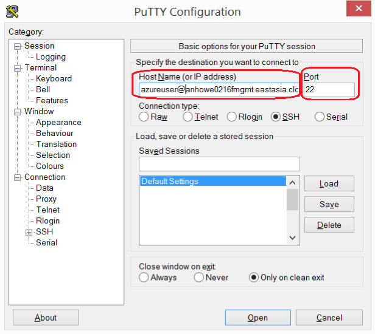
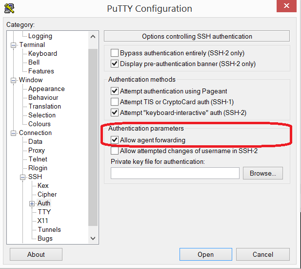
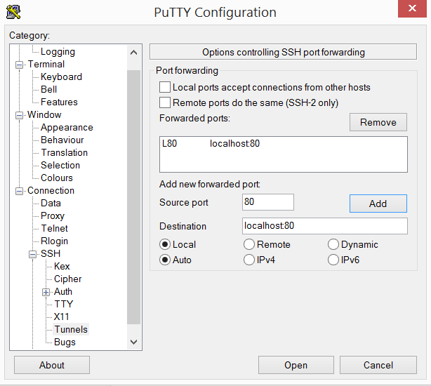

# Microsoft Azure Container Service Engine - SSH

# SSH Key Management

## SSH Key Generation

When creating container services, you will need an SSH RSA key for access.  Use the following articles to create your SSH RSA Key:

1. Windows - https://www.digitalocean.com/community/tutorials/how-to-create-ssh-keys-with-putty-to-connect-to-a-vps
2. Linux - https://help.ubuntu.com/community/SSH/OpenSSH/Keys#Generating_RSA_Keys
3. Mac - https://help.github.com/articles/generating-ssh-keys/#platform-mac

# Key Management and Agent Forwarding with Windows Pageant

Pageant enables agent forwarding.  This means that you can SSH from any of the master nodes directly to any of the agent nodes.  Here are the steps to enable this:
 1. Download and install [Putty Pageant](http://www.chiark.greenend.org.uk/~sgtatham/putty/download.html).
 2. Double Click on pageant.exe to run, and you will notice it appears in your tray

  

 3. Right click on Pageant in the tray and click "View Keys"
 4. Click "Add Key", and add your PPK generated in (#ssh-key-generation).

  

 5. Now try out the configuration by opening up Putty.exe
 6. Type in "azureuser@FQDN" and port 22 where FQDN is the management name returned after deploying a cluster and port:

  

 7. Browse to Connection->SSH->Auth and click "Allow agent forwarding":

  

 8. Click "Open" to connect to the master.  Now ssh directly to an agent, and you will connect automatically. For DC/OS, you can find the hostname of agent from Dashboard on the Nodes page.

# Create Port 80 tunnel to the Master

The DC/OS admin router requires an SSH tunnel from port 80 to port 80.

### Verify you have nothing listening on port 80:
  1. on linux or Mac type `sudo netstat -anpe | grep ":80"` and stop any service or process listening on port 80
  2. on windows, at the command prompt type `netstat -ano | findstr /c:":80"` and stop any service or process listening on port 80.

### Get the "sshMaster0" command:
  1. If using Powershell or CLI, the output parameters are the last values printed
  2. If using Portal, to get the output you need to:
      1. navigate to "resource group"
      2. click on the resource group you just created
      3. then click on "Succeeded" under *last deployment*
      4. then click on the "Microsoft.Template"
      5. now you can copy the output of "sshMaster0"
    

### SSH to the machine
  1. on linux or Mac, modify the ssh command from "sshMaster0", and add `-L 80:localhost:80`, then use that command to connect
  2. on Windows, open Putty and in addition to the instructions from [agent forwarding](#key-management-and-agent-forwarding-with-windows-pageant), browse to Connection->SSH->Tunnel and add "80" to Source Port and "localhost:80" to Destination.
  
