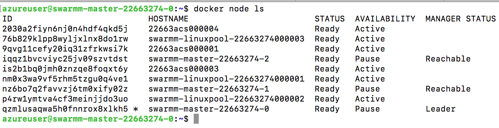
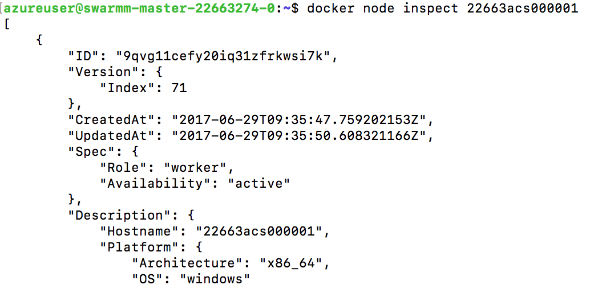
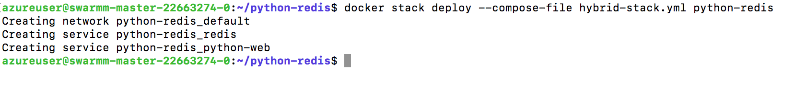
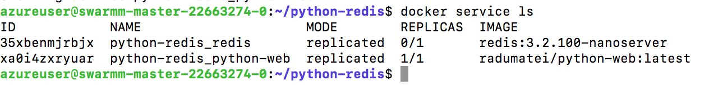
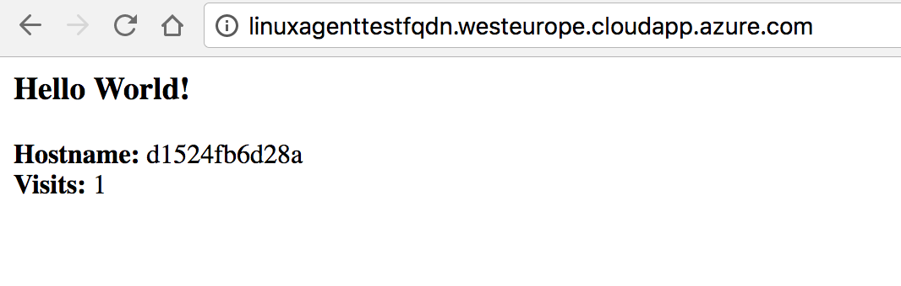

# Microsoft Azure Container Service Engine - Hybrid Swarm Mode Walkthrough

## Deployment

Here are the steps to deploy a Hybrid Swarm Mode cluster:

1. [install acs-engine](acsengine.md#downloading-and-building-acs-engine)
2. [generate your ssh key](ssh.md#ssh-key-generation)
3. edit the [Hybrid Swarm Mode example](../examples/windows/swarmmode-hybrid.json) and fill in the blank strings
4. [generate the template](acsengine.md#generating-a-template)
5. [deploy the output azuredeploy.json and azuredeploy.parameters.json](../README.md#deployment-usage)

## Walkthrough

After you edit the template with your values and deploy, you should have:
-  3 Linux masters
-  3 Linux agents
-  3 Windows agents (with Windows Server 2016 with Containers),
all in the same Swarm.

SSH into one of the masters (`ssh yourlinuxuser@masterfqdn.yourregion.cloudapp.azure.com -p 220x`, where x is the number of your master instance - 0,1,2 in the default case) and list all nodes: `docker node ls`. The output should be similar to this:



> NOTE - if you only see the Linux masters and agents, a working solution is to reimage the Windows agents scale set - that is restoring the VMs to the initial state and restart them. This will reapply all the steps in the installation, [mainly this one that installs the container host and joins the Swarm](https://github.com/Azure/acs-engine/blob/master/parts/swarm/Install-ContainerHost-And-Join-Swarm.ps1).

Now you can inspect one of the Windows agents with `docker node inspect <hostname or id of node>`:




##Limitations

As the [Windows Server Containers documentation](https://docs.microsoft.com/en-us/virtualization/windowscontainers/manage-containers/swarm-mode#limitations) states, at the moment there are a few limitations to Swarm Mode with Windows hosts. 

The most important is that the routing mesh is not available for Windows Server at the moment, but you can publish ports on the host (`docker service create --publish mode=host`)


## Create your first hybrid deployment on the Swarm

Now that you have a functional Hybrid Swarm Mode cluster in Azure, it is time to deploy a hybrid application: a Python front-end that will run on Linux, with a Redis data store on Windows. Here is the stack file for our services:

```
version: "3"
services:

  redis:
    image: redis:3.2.100-nanoserver
    deploy:
      placement:
        constraints: [node.platform.os == windows]

  python-web:
    image: radumatei/python-web
    ports:
      - "80:80"
```

> [The Python application can be found here](https://github.com/microsoft-dx/docker-lab/tree/master/apps/python-redis) and is very similar to the [Docker Compose one from the Official Docker Docs](https://docs.docker.com/compose/gettingstarted/)

On one of the masters create the file above and name it `hybrid-stack.yml`. In order to deploy it, execute: `docker stack deploy --compose-file hybrid-stack.yml python-redis`:




Now if you execute `docker service ls` you should see the two services:



[Since the Nanoserver Redis image](https://hub.docker.com/r/library/redis/) is around 340 MB, it will take a little to pull it, then start a container.
After the container started, we can go to the Linux agents FQDN (the one you setup when editing the `swarmmode-hybrid.json` file) and access it from a browser:

> Note that on the first run it might take a little while



## Learning more

Here are recommended links to learn more about Swarm Mode, Docker, and Docker Compose:

1. [Docker](https://docs.docker.com/) - learn more through Docker documentation.

2. [Docker Swarm Mode](https://docs.docker.com/engine/swarm/) - learn more about Docker Swarm Mode.

For hybrid swarms, you can check the following resources:

3. Use Docker Swarm to run a Windows+Linux containerized application - [Part 1](https://www.youtube.com/watch?v=ZfMV5JmkWCY&t=170s), [Part 2](https://www.youtube.com/watch?v=VbzwKbcC_Mg&t=406s), [Part 3](https://www.youtube.com/watch?v=I9oDD78E_1E&t=354s)

4. [The Hybrid Swarm: Running Windows and Linux Apps in one Docker Cluster - Talk by Elton Stoneman, Docker Captain](https://channel9.msdn.com/Events/DXPortugal/OSCAMP-Open-Source-Software-powered-by-Bright-Pixel/The-Hybrid-Swarm-Running-Windows-and-Linux-Apps-in-one-Docker-Cluster)
