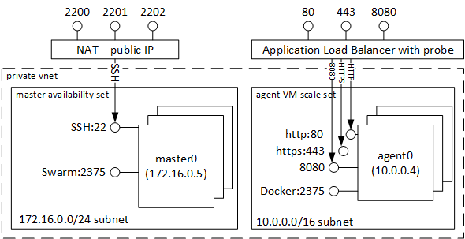
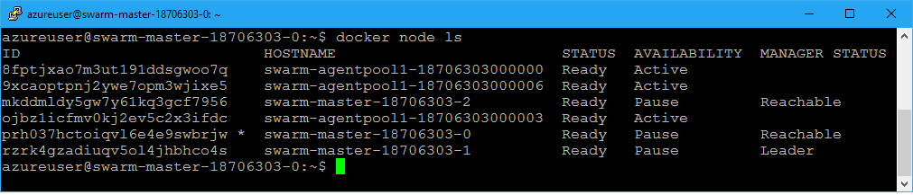
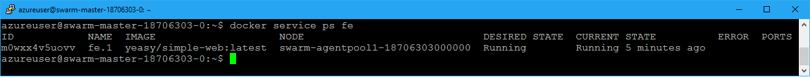
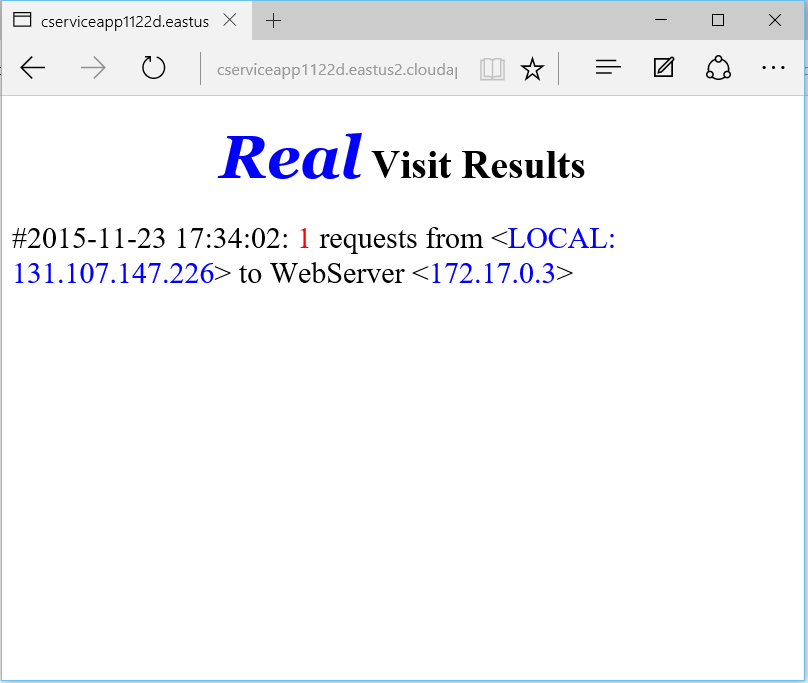
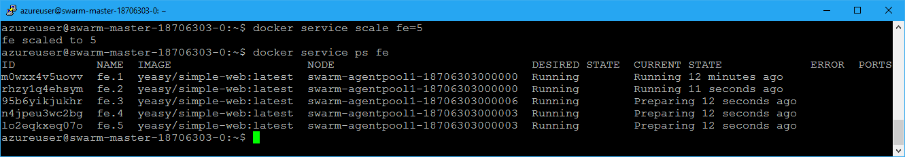

# Microsoft Azure Container Service Engine - Swarm Mode Walkthrough

## Deployment

Here are the steps to deploy a simple Swarm Mode cluster:

1. [install acs-engine](acsengine.md#downloading-and-building-acs-engine)
2. [generate your ssh key](ssh.md#ssh-key-generation)
3. edit the [Swarm Mode example](../examples/swarmmode.json) and fill in the blank strings
4. [generate the template](acsengine.md#generating-a-template)
5. [deploy the output azuredeploy.json and azuredeploy.parameters.json](../README.md#deployment-usage)

## Walkthrough

Once your Swarm Mode cluster has been deployed you will have a resource group containing:

1. a set of 1,3, or 5 masters in a master availability set.  Each master's SSH can be accessed via the public dns address at ports 2200..2204. First master's SSH can also be accessed via public dns address on port 22.

2. a set of agents in a VM scale set (VMSS).  The agent VMs can be accessed through a master.  See [agent forwarding](ssh.md#key-management-and-agent-forwarding-with-windows-pageant) for an example of how to do this.

The following image shows the architecture of a container service cluster with 3 masters, and 3 agents:

 

 All VMs are in the same VNET where the masters are on private subnet 172.16.0.0/24 and the agents are on the private subnet, 10.0.0.0/16, and fully accessible to each other.

## Create your First Two Swarm Mode Docker services: hello-world, and Docker web app

After completing this walkthrough you will know how to:
 * display information from Swarm Mode,
 * deploy a simple Docker hello-world app using docker-compose,
 * and deploy a simple Docker web app publically available to the world.

 1. After successfully deploying the template write down the two output master and agent FQDNs (Fully Qualified Domain Name).
    1. If using Powershell or CLI, the output parameters are the last values printed.
    2. If using Portal, to get the output you need to:
        1. navigate to "resource group"
        2. click on the resource group you just created
        3. then click on "Succeeded" under *last deployment*
        4. then click on the "Microsoft.Template"
        5. now you can copy the output FQDNs and sample SSH commands
        
        

 2. SSH to port 2200 of the master FQDN (or first master's SSH can also be accessed via public dns address on port 22.). See [agent forwarding](ssh.md#key-management-and-agent-forwarding-with-windows-pageant) for an example of how to do this.

 3. Type `docker node ls` to view the list of nodes (and their status) in the Swarm.
 

 4. Type `docker run -it hello-world` to see the hello-world test app run on one of the agents (the '-it' switches ensure output is displayed on your client)

 5. Now let's create a simple service in a swarm and expose it to the world.  Type `docker service create --name fe --publish 80:80 yeasy/simple-web`

 6. Once completed, type `docker service ps fe` to see the running service.

 

 7. In your web browser hit the AGENTFQDN endpoint (**not the master FQDN**) you recorded in step #1 and you should see the following page, with a counter that increases on each refresh.

 

 8. You can now scale the service.  You can type `docker service scale fe=5`, and this will scale up the service to the desired number of replicas.  

 

# Learning More

Here are recommended links to learn more about Swarm Mode, Docker, and Docker Compose:

1. [Docker](https://docs.docker.com/) - learn more through Docker documentation.

2. [Docker Swarm Mode](https://docs.docker.com/engine/swarm/) - learn more about Docker Swarm Mode.