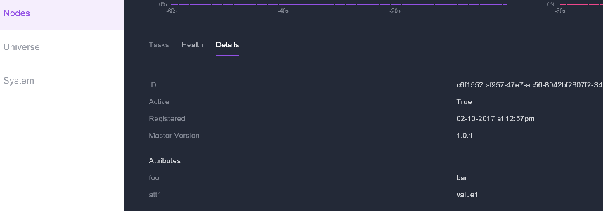

# DCOS Agent Node Attributes

Attributes can be defined for each agent node type.
The attributes can then be used with Marathon deployments as [placement contraints](https://mesosphere.github.io/marathon/docs/constraints.html).

Attributes can easily be defined in AgentPoolProfile property of the API Model

The definition below adds 2 attributes `"foo"` and `"att1"` to all nodes in the `agentprivate` pool. 

```
    "agentPoolProfiles": [
      {
        "name": "agentprivate",
        "count": 3,
        "vmSize": "Standard_D2_v2",
        "customNodeLabels" : {
          "foo" : "bar",
          "att1" : "value1"
        } 
      }
    ]
```

You can confirm the attributes on the Node Details:
 
