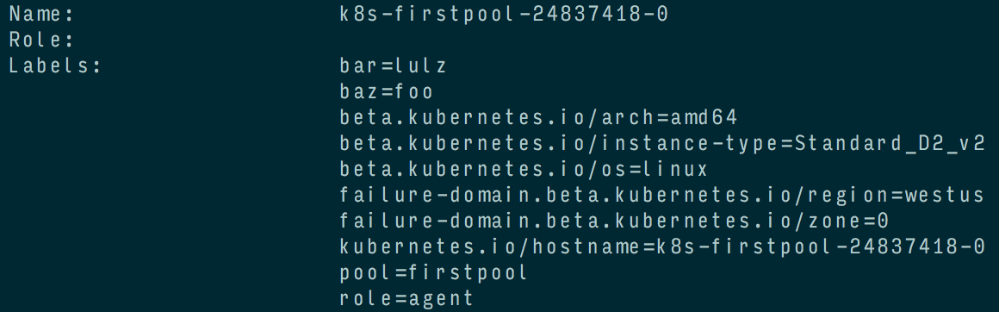

# Kubernetes Agent Node Labels

Labels can be defined for each agent node tye.
The labels can then be used with Kubernetes deployments as [label selectors](https://kubernetes.io/docs/concepts/overview/working-with-objects/labels/#label-selectors)

Labels can be easily defined in the AgentPoolProfile property of the API Model

The definition below adds 2 labels `"bar"` and `"baz"` to all nodes in the `firstpool` pool.

```
    "agentPoolProfiles": [
      {
        "name": "firstpool",
        "count": 3,
        "vmSize": "Standard_D2_v2",
        "availabilityProfile": "AvailabilitySet",
        "customNodeLabels": {
          "bar": "lulz",
          "baz": "foo"
        }
      }
    ],
```

In addition to any custom node labels you may add, ACS Engine will add another label, `"agentpool"`, which identifies which Agent Pool the node belongs to.

You can confirm the labels have been applied on the node by running `kubectl describe node <nodename>`:

