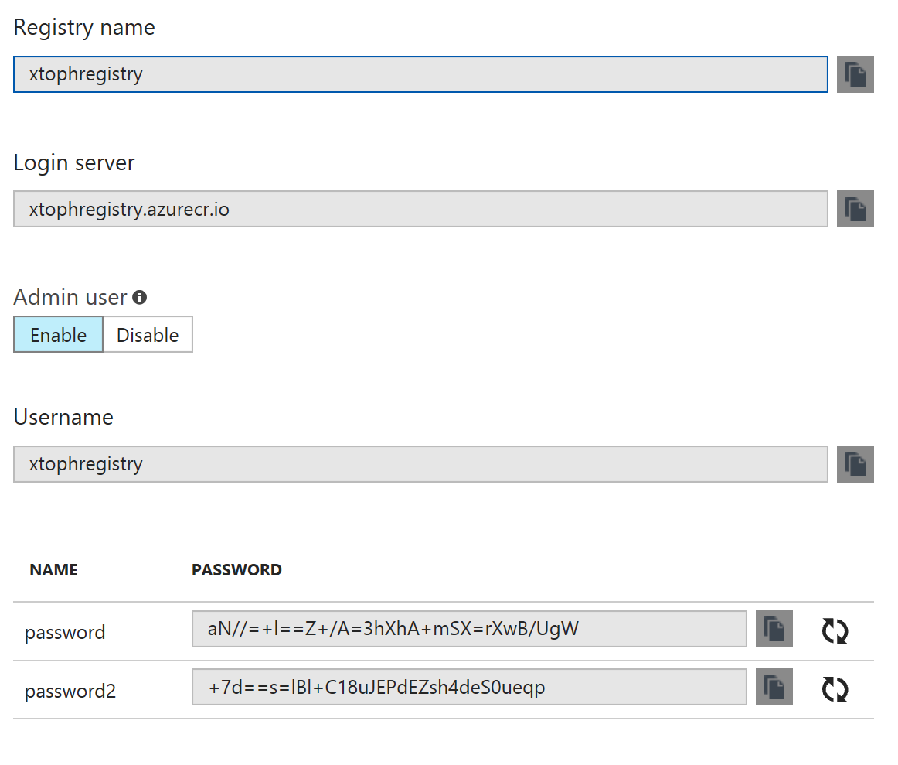
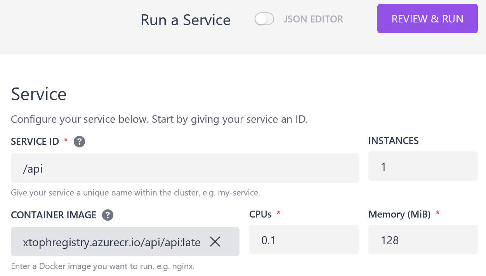
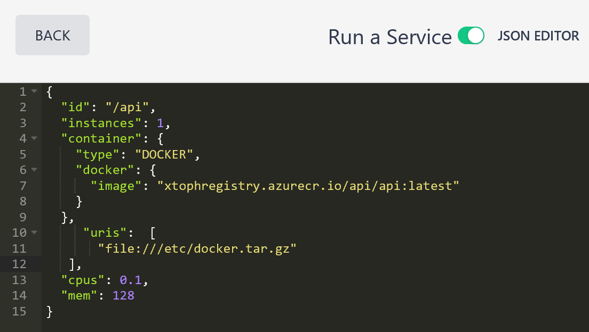
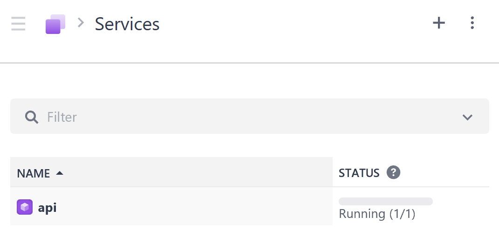

# Private Registry Support

ACS can deploy credentials to private registries to agent nodes DC/OS clusters.

The credentials are specified in the orchestrator profile in the apimodel:
```
  "properties": {
    "orchestratorProfile": {
      "orchestratorType": "DCOS",
      "Registry" : "",
      "RegistryUser" : "",
      "RegistryPassword" : ""
    },
```

The agent provisioning process will then create a tar archive containing a docker config as documented at: [Using a Private Docker Registry](https://docs.mesosphere.com/1.9/deploying-services/private-docker-registry/)

## Example
Let's provision a DC/OS cluster with credentials to an [Azure Container Registry](https://azure.microsoft.com/en-us/services/container-registry/) deployed to every agent node.

- First, [provision an Azure Container Registry](https://docs.microsoft.com/en-us/azure/container-registry/container-registry-managed-get-started-portal).  

- Enable Admin Access and note the registry credentials


- Clone [acs-engine](http://github.com/azure/acs-engine) and [start the container with the dev environment](https://github.com/Azure/acs-engine/blob/master/docs/acsengine.md).

- Edit the API model to include the credentials
```
  "properties": {
    "orchestratorProfile": {
      "orchestratorType": "DCOS",
      "Registry" : "xtophregistry.azurecr.io",
      "RegistryUser" : "xtophregistry",
      "RegistryPassword" : "aN//=+l==Z+/A=3hXhA+mSX=rXwB/UgW"
    },
```

- Run acs-engine to create ARM templates
```
./acs-engine examples/privateregistry/dcos.json
```

- Deploy the cluster
```
az group create -l eastus -n cluster-rg
az group deployment create -g cluster-rg --template-file _output/dcoscluster/azuredeploy.json --parameters @_output/dcoscluster/azuredeploy.parameters.json
```

- Create a Service to deploy a container from the ACR


- Add the credential path on the agent using the JSON editor


- See the Service running


- Check the credential deployment


## Limitations
- The API model currenlty only supports credentials to a single registry.
- Not tested with Kubernetes clusters
- Credentials have to be updated on each node 