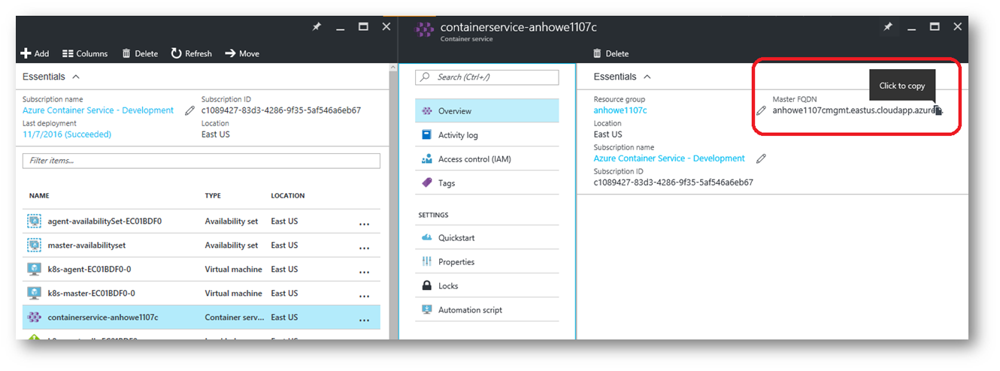
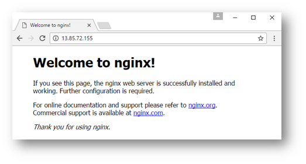

# Microsoft Azure Container Service Engine - Kubernetes Walkthrough

## Deployment

Here are the steps to deploy a simple Kubernetes cluster:

1. [generate your ssh key](https://github.com/Azure/azure-quickstart-templates/blob/master/101-acs-dcos/docs/SSHKeyManagement.md#ssh-key-generation)
3. [generate your service principal](https://github.com/Azure/acs-engine/blob/master/docs/serviceprincipal.md)
4. Click the [Deploy to Azure Button on README](../README.md) and fill in the fields

## Walkthrough

Once your Kubernetes cluster has been created you will have a resource group containing:

1. 1 master accessible by SSH on port 22 or kubectl on port 443

2. a set of nodes in an availability set.  The nodes can be accessed through a master.  See [agent forwarding](https://github.com/Azure/azure-quickstart-templates/blob/master/101-acs-dcos/docs/SSHKeyManagement.md#key-management-and-agent-forwarding-with-windows-pageant) for an example of how to do this.

The following image shows the architecture of a container service cluster with 1 master, and 2 agents:


In the image above, you can see the following parts:

1. **Master Components** - The master runs the Kubernetes scheduler, api server, and controller manager.  Port 443 is exposed for remote management with the kubectl cli.
2. **Nodes** - the Kubernetes nodes run in an availability set.  Azure load balancers are dynamically added to the cluster depending on exposed services. 
3. **Common Components** - All VMs run a kubelet, Docker, and a Proxy.
4. **Networking** - All VMs are assigned an ip address in the 10.240.0.0/16 network.  Each VM is assigned a /24 subnet for their pod CIDR enabling IP per pod.  The proxy running on each VM implements the service network 10.0.0.0/16.

All VMs are in the same private VNET and are fully accessible to each other.

## Create your First Kubernetes Service

After completing this walkthrough you will know how to:
 * access Kubernetes cluster via SSH,
 * deploy a simple Docker application and expose to the world,
 * the location of the Kube config file and how to access the Kubernetes cluster remotely,
 * use `kubectl exec` to run commands in a container, 
 * and finally access the Kubernetes dashboard.

1. After successfully deploying the template write down the master FQDNs (Fully Qualified Domain Name).
   1. If using Powershell or CLI, the output parameter is in the OutputsString section named 'masterFQDN'
   2. If using Portal, browse to the Overview blade of the ContainerService resource to copy the "Master FQDN":
     
   

2. SSH to the master FQDN obtained in step 1.

3. Explore your nodes and running pods:
  1. to see a list of your nodes type `kubectl get nodes`.  If you want full detail of the nodes, add `-o yaml` to become `kubectl get nodes -o yaml`.
  2. to see a list of running pods type `kubectl get pods --all-namespaces`.

4. Start your first Docker image by typing `kubectl run nginx --image nginx`.  This will start the nginx Docker container in a pod on one of the nodes.

5. Type `kubectl get pods -o yaml` to see the full details of the nginx deployment. You can see the host IP and the podIP.  The pod IP is assigned from the pod CIDR on the host.  Run curl to the pod ip to see the nginx output, eg. `curl 10.244.1.4`

  

6. The next step is to expose the nginx deployment as a Kubernetes service on the private service network 10.0.0.0/16:
  1. expose the service with command `kubectl expose deployment nginx --port=80`.
  2. get the service IP `kubectl get service`
  3. run curl to the IP, eg. `curl 10.0.105.199`

  

7. The final step is to expose the service to the world.  This is done by changing the service type from `ClusterIP` to `LoadBalancer`:
  1. edit the service: `kubectl edit svc/nginx`
  2. change `type` from `ClusterIP` to `LoadBalancer` and save it.  This will now cause Kubernetes to create an Azure Load Balancer with a public IP.
  3. the change will take about 2-3 minutes.  To watch the service change from "pending" to an external ip type `watch 'kubectl get svc'`

  

  4. once you see the external IP, you can browse to it in your browser:

    

8. The next step in this walkthrough is to show you how to remotely manage your Kubernetes cluster.  First download Kubectl to your machine and put it in your path:
  * [Windows Kubectl](https://storage.googleapis.com/kubernetes-release/release/v1.4.5/bin/windows/amd64/kubectl.exe)
  * [OSX Kubectl](https://storage.googleapis.com/kubernetes-release/release/v1.4.5/bin/darwin/amd64/kubectl)
  * [Linux](https://storage.googleapis.com/kubernetes-release/release/v1.4.5/bin/linux/amd64/kubectl)

9. The Kubernetes master contains the kube config file for remote access under the home directory ~/.kube/config.  Download this file to your machine, set the KUBECONFIG environment variable, and run kubectl to verify you can connect to cluster:
  * Windows to use pscp from [putty](http://www.chiark.greenend.org.uk/~sgtatham/putty/download.html).  Ensure you have your certificate exposed through [pageant](SSHKeyManagement.md#key-management-and-agent-forwarding-with-windows-pageant):
  ```
  # MASTERFQDN is obtained in step1
  pscp azureuser@MASTERFQDN:.kube/config .
  SET KUBECONFIG=%CD%\config
  kubectl get nodes
  ```
  * OS X or Linux:
  ```
  # MASTERFQDN is obtained in step1
  scp azureuser@MASTERFQDN:.kube/config .
  export KUBECONFIG=`pwd`/config
  kubectl get nodes
  ```
10. The next step is to show you how to remotely run commands in a remote Docker container:
  1. Run `kubectl get pods` to show the name of your nginx pod
  2. using your pod name, you can run a remote command on your pod.  eg. `kubectl exec nginx-701339712-retbj date`
  3. try running a remote bash session. eg. `kubectl exec nginx-701339712-retbj -it bash`.  The following screen shot shows these commands:

  

11. The final step of this tutorial is to show you the dashboard:
  1. run `kubectl proxy` to directly connect to the proxy
  2. in your browser browse to the [dashboard](http://127.0.0.1:8001/api/v1/proxy/namespaces/kube-system/services/kubernetes-dashboard/#/workload?namespace=_all)
  3. browse around and explore your pods and services.
  

# Learning More

Here are recommended links to learn more about Kubernetes:

1. [Azure Kubernetes documentation](https://azure.microsoft.com/en-us/documentation/services/container-service/)

## Kubernetes Community Documentation

1. [Kubernetes Bootcamp](https://kubernetesbootcamp.github.io/kubernetes-bootcamp/index.html) - shows you how to deploy, scale, update, and debug containerized applications.
2. [Kubernetes Userguide](http://kubernetes.io/docs/user-guide/) - provides information on running programs in an existing Kubernetes cluster.
3. [Kubernetes Examples](https://github.com/kubernetes/kubernetes/tree/master/examples) - provides a number of examples on how to run real applications with Kubernetes.